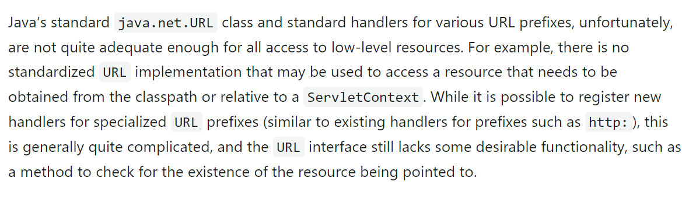
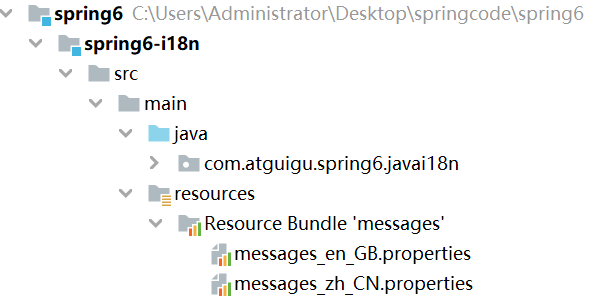

# Spring笔记

## 一、入门

**1.1第一个程序分析**

从三个问题开始分析：

1. 之前创建对象，是无参数构造执行吗？

2. 不用new方法，还能如何创建对象？

   （1）反射：

   1. 加载bean.xml配置文件

   2. 对xml文件进行解析操作

   3. 获取xml文件bean标签属性值（id和class属性值）

   4. 使用反射根据类的全路径创建对象

      ```java
      //获取字节码文件对象
      Class clazz = Class.forname("com.demo.spring6.User");
      //调用
      //Object o = clazz.newInstance();
      User user = (User)clazz.getDeclaredConstructor().newInstance();
      System.out.printf(user);
      ```

3. 创建对象放在哪里？

   (两次shift可以搜索类)

   ```java
   //这可以说是Ioc的体现之一
   Map<String, BeanDefinition> beanDefinitionMap
       //key:唯一标识就比如说getBean("key")获取
       //vlaue:类的定义（描述信息）

​	

**1.2整合Log4j2**

**级别高的会自动屏蔽级别低的日志，也就是说，设置了WARN的日志，则INFO、DEBUG的日志级别的日志不会显示**

手动写入日子

## 二、容器：IoC

### 2.0 简述产生过程

一个类想要调用另一个类中的方法有很多种方法

1. 最原始的方法：导包创建类对象，然后调用（耦合度太高）

   ```java
   class service {
       UserDao userdao = new UserDao();
       userdao.add();
   }
   ```

   

2. 工厂模式(降低耦合度)：

   创建一个工厂：

   ```java
   class UserFactory {
       public static UserDao getDao() {
           return new UserDao();
       }
   }
   class Service{
       public execute() {
           UserDao dao = UserFactory.getDao();
           dao.add();
       }
   }
   ```

3. IoC原理(进一步降低耦合度)

   xml解析 + 工厂模式 + 反射

   第一步：xml配置文件，配置创建的对象

   ```xml
   <bean id="dao" class="com.demo.UserDao"></bean>
   ```

   第二部：创建工厂类

   ```java
   class UserFactory {
       public static UserDao getDao() {
           String classValue = class属性值：//xml解析
           //通过反射创建对象
           Class clazz = Class.forName(classValue);
           return (UserDao)clazz.newInstance();
       }
   }
   ```

#### 2.0.1

1. IoC思想基于IoC容器完成，IOC容器底层就是对象工程

2. Spring提供IOC容器两者实现方式：（两个接口）

   （1）BeanFactory：IOC容器基本实现，是Spring内部使用接口，不提供开发人员

   **加载配置文件时候不会创建对象，在获取调用对象的时候才去创建对象（懒加载）**

   （2）**ApplicationContext**：BeanFactory接口的子接口，有更多更强大的接口，开发人员

   **加载配置文件时候会把配置文件中对象就会创建**

3. ApplicationContext

### **2.1概述**

IoC 是 **Inversion of Control **的简写，译为“**控制反转**”，它不是一门技术，而是一种**设计思想**，是一个重要的面向对象编程法则，能够指导我们如何设计出松耦合、更优良的程序。

Spring 通过 **IoC** 容器来管理**所有 Java 对象的实例化和初始化，控制对象与对象之间的依赖关系**。我们将由 IoC 容器管理的 Java 对象称为 Spring Bean，它与使用关键字 new 创建的 Java 对象没有任何区别。

IoC 容器是 Spring 框架中最重要的核心组件之一，它贯穿了 Spring 从诞生到成长的整个过程

容器放bean对象，是用Map来储存

获取bean类的定义信息的方式有：

1. xml配置文件方式（如案例一）
2. 注解方式

**2.1.1xml配置文件方式获取定义信息过程**

解析xml配置文件：获得Bean定义信息：```BeanDefinition```

要将定义信息加载读取到IoC容器里面去，要用到一个抽象（接口），接口中有不同的实现类：```BeanDefinitionReader```

之后进行实例化：```BeanFactory```工厂加反射后初始化，等到最终对象

### 2.2IOC两个关键思想

#### 2.2.1控制反转（IOC）

将对象的创建权力交出去，交给第三方容器负责

将对象和对象之间关系的维护权交出去，交给第三方容器负责

* 如何实现？**通过DI（Dependency Injection）依赖注入**

#### 2.2.2依赖注入（DI）

**依赖注入：**

- **指Spring创建对象的过程中，将对象依赖属性通过配置进行注入**

依赖注入常见的实现方式包括两种：

- 第一种：set注入
- 第二种：构造注入

所以结论是：IOC 就是一种控制反转的思想， 而 DI 是对IoC的一种具体实现。

**Bean管理说的是：Bean对象的创建，以及Bean对象中属性的赋值（或者叫做Bean对象之间关系的维护）。**

### 2.3IoC容器在Spring中的实现

1. IoC思想基于IoC容器完成，IOC容器底层就是对象工程

2. Spring提供IOC容器两者实现方式：（两个接口）

   （1）BeanFactory：IOC容器基本实现，是Spring内部使用接口，不提供开发人员

   **加载配置文件时候不会创建对象，在获取调用对象的时候才去创建对象（懒加载）**

   （2）**ApplicationContext**：BeanFactory接口的子接口，有更多更强大的接口，开发人员

   **加载配置文件时候会把配置文件中对象就会创建**

3. ApplicationContext

| 类型名                          | 简介                                                         |
| ------------------------------- | ------------------------------------------------------------ |
| ClassPathXmlApplicationContext  | 通过读取类路径下的 XML 格式的配置文件创建 IOC 容器对象       |
| FileSystemXmlApplicationContext | 通过文件系统路径读取 XML 格式的配置文件创建 IOC 容器对象     |
| ConfigurableApplicationContext  | ApplicationContext 的子接口，包含一些扩展方法 refresh() 和 close() ，让 ApplicationContext 具有启动、关闭和刷新上下文的能力。 |
| WebApplicationContext           | 专门为 Web 应用准备，基于 Web 环境创建 IOC 容器对象，并将对象引入存入 ServletContext 域中。 |

### 2.4基于XML管理Bean

#### 2.4.1测试一：获取bean的方法

```java
  		ApplicationContext context = new
                ClassPathXmlApplicationContext("bean.xml");
        //根据ID获取
        User user1 = (User)context.getBean("user");
        System.out.println("根据ID获取bean：" + user1);

        //根据类型获取
		//当根据类型获取bean时，要求IOC容器中指定类型的bean有且只能有一个
        User user2 = context.getBean(User.class);
        System.out.println("根据类型获取bean："+ user2);

        //根据id和类型获取bean
        User user3 = context.getBean("user",User.class);
        System.out.println("根据id和类型获取bean："+ user3);
```

**#扩展知识**

* 如果在xml文件组件中类实现了接口，根据接口类型可以获取bean吗？

  ```xml
  <bean id="userDaoImpl" class="com.demo.spring6.iocxml.bean.UserDaoImpl"></bean>
  ```

  ```java
  UserDao userDao = context.getBean(UserDao.class);
  ```

  > 可以，前提是bean唯一

* 如果一个接口有多个实现类。这些实现都配置了bean，根据接口类型就可以获取bean吗？

  > 不可以

#### 2.4.2测试二：依赖注入之setter注入

1. 创建类，定义属性，生成属性set方法

2. 在spring配置文件中配置

   ```xml
       <bean id="book" class="com.demo.spring6.iocxml.di.Book">
           <property name="bname" value="前端开发"></property>
           <property name="author" value="我"></property>
       </bean>
   ```

#### 2.4.3测试三：依赖注入之构造器注入

1. 创建类，定义属性，生成有参构造

2. 在spring配置文件中配置

   ```xml
       <!-- 构造器注入-->
       <bean id="bookCon" class="com.demo.spring6.iocxml.di.Book">
           <constructor-arg name="bname" value="java开发"></constructor-arg>
           <constructor-arg name="author" value="我"></constructor-arg>
       </bean>
   ```

#### 2.4.4测试四：特殊类型属性注入

1. 字面量赋值

   > 什么是字面量？
   >
   > int a = 10;
   >
   > 声明一个变量a，初始化为10，此时a就不代表字母a了，而是作为一个变量的名字。当我们引用a的时候，我们实际上拿到的值是10。
   >
   > 而如果a是带引号的：'a'，那么它现在不是一个变量，它就是代表a这个字母本身，这就是字面量。所以字面量没有引申含义，就是我们看到的这个数据本身。

2. null值

   ```xml
   <property name="others" >
   	<null/>
   </property>
   ```

3. xml实体

   ```xml
   <!-- 小于号在XML文档中用来定义标签的开始，不能随便使用 -->
   <!-- 解决方案一：使用XML实体来代替 -->
   <property name="expression" value="a &lt; b"/>
   <!-- &lt表示小于号，%&gt表示大于号-->
   ```


4. CDATA节

   ```xml
   <property name="expression">
       <!-- 解决方案二：使用CDATA节 -->
       <!-- CDATA中的C代表Character，是文本、字符的含义，CDATA就表示纯文本数据 -->
       <!-- XML解析器看到CDATA节就知道这里是纯文本，就不会当作XML标签或属性来解析 -->
       <!-- 所以CDATA节中写什么符号都随意 -->
       <value><![CDATA[a < b]]></value>
   </property>
   ```

#### 2.4.5测试五：为对象类型属性赋值

（在idea重新载入子项目，将子项目的pom.xml文件设置为unignore）

##### 方法一：引入外部bean

```xml
    <bean id="dept" class="com.demo.spring6.iocxml.ditest.Dept">
        <property name="dname" value="安保部"></property>
    </bean>

    <bean id="emp" class="com.demo.spring6.iocxml.ditest.Emp">
        <!-- 普通属性注入-->
        <property name="ename" value="lucy"></property>
        <property name="age" value="50"></property>
        <!-- 注入对象类型属性-->
        <property name="dept" ref="dept"></property>
    </bean>
```

##### 方法二：内部bean

```xml
<bean id="emp2" class="com.demo.spring6.iocxml.ditest.Emp">
        <!-- 普通属性注入-->
        <property name="ename" value="mary"></property>
        <property name="age" value="20"></property>
        <!-- 注入对象类型属性-->
        <property name="dept">
            <bean id="dept2" class="com.demo.spring6.iocxml.ditest.Dept">
                <property name="dname" value="财务部"></property>
            </bean>
        </property>
    </bean>
```

##### 方法三：级联属性赋值

```xml
    <!-- 第三种方式级联方式-->
    <bean id="dept3" class="com.demo.spring6.iocxml.ditest.Dept">
        <property name="dname" value="研发部"></property>
    </bean>
    <bean id="emp3" class="com.demo.spring6.iocxml.ditest.Emp">
        <property name="ename" value="tony"></property>
        <property name="age" value="22"></property>
        <property name="dept" ref="dept3"></property>
        <property name="dept.dname" value="测试部"></property>
    </bean>
```

#### 2.4.6测试六：数组类型的注入

```xml
    <bean id="dept" class="com.demo.spring6.iocxml.ditest.Dept">
        <property name="dname" value="研发部"></property>
    </bean>
    <bean id="emp" class="com.demo.spring6.iocxml.ditest.Emp">
        <property name="ename" value="lucy"></property>
        <property name="age" value="20"></property>
        <!-- 对象类型的注入-->
        <property name="dept" ref="dept"></property>

        <!-- 数组类型的注入-->
        <property name="loves">
            <array>
                <value>吃饭</value>
                <value>睡觉</value>
                <value>打篮球</value>
            </array>
        </property>
    </bean>
```

#### 2.4.7测试七：List集合类型的注入

```xml
   <bean id="empone" class="com.demo.spring6.iocxml.ditest.Emp">
        <property name="ename" value="lucy"></property>
        <property name="age" value="29"></property>
    </bean>
    <bean id="emptwo" class="com.demo.spring6.iocxml.ditest.Emp">
        <property name="ename" value="tom"></property>
        <property name="age" value="34"></property>
    </bean>
    <bean id="dept" class="com.demo.spring6.iocxml.ditest.Dept">
        <property name="dname" value="技术部门"></property>
        <property name="empList">
            <list>
                <ref bean="empone"></ref>
                <!-- 集合里面的类型是Emp，若是String常规的，直接用value标签-->
                <ref bean="emptwo"></ref>
            </list>
        </property>
    </bean>
```


#### 2.4.8测试八：Map集合类型的注入

在Student类型里面有一个Map<String,Teacher>类型的

```xml
    <bean id="teacherone" class="com.demo.spring6.iocxml.dimap.Teacher">
        <property name="teacherId" value="100"></property>
        <property name="teacherName" value="蒋老师"></property>
    </bean>
    <bean id="teachertwo" class="com.demo.spring6.iocxml.dimap.Teacher">
        <property name="teacherId" value="200"></property>
        <property name="teacherName" value="即老师"></property>
    </bean>
    <bean id="student" class="com.demo.spring6.iocxml.dimap.Student">
        <!-- 注入普通属性-->
        <property name="sid" value="2000"></property>
        <property name="sname" value="张三"></property>
        <!-- 注入Map集合-->
        <property name="teacherMap">
            <map>
                <entry>
                    <key>
                        <value>10010</value>
                    </key>
                    <!-- 这里的集合是对象，如果是常规类型直接用value标签-->
                    <ref bean="teacherone"></ref>
                </entry>
                <entry>
                    <key>
                        <value>10086</value>
                    </key>
                    <!-- 这里的集合是对象，如果是常规类型直接用value标签-->
                    <ref bean="teachertwo"></ref>
                </entry>
            </map>
        </property>
    </bean>
```

#### 2.4.9测试九：引用集合类型的bean

要引入util标签约束规则

```xml
<beans xmlns="http://www.springframework.org/schema/beans"
       xmlns:xsi="http://www.w3.org/2001/XMLSchema-instance"
       xmlns:util="http://www.springframework.org/schema/util"
       xsi:schemaLocation="http://www.springframework.org/schema/util
    http://www.springframework.org/schema/util/spring-util.xsd
    http://www.springframework.org/schema/beans
    http://www.springframework.org/schema/beans/spring-beans.xsd">
```

具体内容

```xml
<bean id="student" class="com.demo.spring6.iocxml.dimap.Student">
        <property name="sid" value="10000"></property>
        <property name="sname" value="lucy"></property>
        <!-- 注入list，map类型属性-->
        <property name="lessonList" ref="lessonList"></property>
        <property name="teacherMap" ref="teacherMap"></property>
    </bean>
        <util:list id="lessonList">
            <ref bean="lessonone"></ref>
            <ref bean="lessontwo"></ref>
        </util:list>
        <util:map id="teacherMap">
            <entry>
                <key>
                    <value>10010</value>
                </key>
                <ref bean="teacherone"></ref>
            </entry>
            <entry>
                <key>
                    <value>10086</value>
                </key>
                <ref bean="teachertwo"></ref>
            </entry>
        </util:map>
    <bean id="lessonone" class="com.demo.spring6.iocxml.dimap.Lesson">
        <property name="lessonName" value="java开发"></property>
    </bean>
    <bean id="lessontwo" class="com.demo.spring6.iocxml.dimap.Lesson">
        <property name="lessonName" value="java开发"></property>
    </bean>

    <bean id="teacherone" class="com.demo.spring6.iocxml.dimap.Teacher">
        <property name="teacherId" value="100"></property>
        <property name="teacherName" value="发老师"></property>
    </bean>
    <bean id="teachertwo" class="com.demo.spring6.iocxml.dimap.Teacher">
        <property name="teacherId" value="200"></property>
        <property name="teacherName" value="的老师"></property>
    </bean>
```

#### 2.4.10测试十：p命名空间

先要加上p命名空间约束

```xml
xmlns:p="http://www.springframework.org/schema/p"
```

实例：

```xml
    <!-- p命名空间-->
    <bean id="studentp" class="com.demo.spring6.iocxml.dimap.Student"
    p:sid="100" p:sname="mary" p:lessonList-ref="lessonList" p:teacherMap-ref="teacherMap">
    </bean>

```

#### 2.4.11测试十一：引入外部配置文件

**①加入数据库相关依赖**

**②创建外部配置文件，properties格式**

**③创建spring配置文件，引入context命名空间，引入属性文件，使用表达式完成注入**

```xml
<?xml version="1.0" encoding="UTF-8"?>
<beans xmlns="http://www.springframework.org/schema/beans"
       xmlns:xsi="http://www.w3.org/2001/XMLSchema-instance"
       xmlns:context="http://www.springframework.org/schema/context"
       xsi:schemaLocation="http://www.springframework.org/schema/beans
       http://www.springframework.org/schema/beans/spring-beans.xsd
       http://www.springframework.org/schema/context
       http://www.springframework.org/schema/context/spring-context.xsd"
>
    <!-- 引入外部属性文件-->
    <context:property-placeholder location="classpath:jdbc.properties"></context:property-placeholder>

    <!-- 完成数据库信息注入-->
    <bean id="druidDataSource" class="com.alibaba.druid.pool.DruidDataSource">
        <property name="url" value="${jdbc.url}"></property>
        <property name="username" value="${jdbc.user}"></property>
        <property name="password" value="${jdbc.password}"></property>
        <property name="driverClassName" value="${jdbc.driver}"></property>
    </bean>

</beans>
```

#### 2.4.12测试十二：bean的作用域

**①概念**

在Spring中可以通过配置bean标签的scope属性来指定bean的作用域范围，各取值含义参加下表：

| 取值              | 含义                                    | 创建对象的时机  |
| ----------------- | --------------------------------------- | --------------- |
| singleton（默认） | 在IOC容器中，这个bean的对象始终为单实例 | IOC容器初始化时 |
| prototype         | 这个bean在IOC容器中有多个实例           | 获取bean时      |

如果是在WebApplicationContext环境下还会有另外几个作用域（但不常用）：

| 取值    | 含义                 |
| ------- | -------------------- |
| request | 在一个请求范围内有效 |
| session | 在一个会话范围内有效 |

#### 2.4.13测试十三：bean的生命周期

**①具体的生命周期过程**

- bean对象创建（调用无参构造器）

- 给bean对象设置属性

  ```java
  public class User {
  
      private String name;
  
      public User() {
          System.out.println("1 调用了无参构造");
      }
      public void initMethod() {
          System.out.println("4 对象初始化，调用指定的初始方法");
      }
      public void destroyMethod() {
          System.out.println("7 对象摧毁，调用指定的摧毁方法");
      }
  
      public String getName() {
          return name;
      }
  
      public void setName(String name) {
          System.out.println("2 给bean对象设置属性值");
          this.name = name;
      }
  }
  ```

- bean的后置处理器（初始化之前）

- bean对象初始化（需在配置bean时指定初始化方法）

- bean的后置处理器（初始化之后）

  ```java
  public class MyBeanPost implements BeanPostProcessor {
  
      @Override
      public Object postProcessBeforeInitialization(Object bean, String beanName) throws BeansException {
          System.out.println("3 bean后置处理器，在初始化之前执行");
          System.out.println(beanName + "::" + bean);
          return bean;
      }
  
      @Override
      public Object postProcessAfterInitialization(Object bean, String beanName) throws BeansException {
          System.out.println("5 bean后置处理器，在初始化之后执行");
          System.out.println(beanName + "::" + bean);
          return bean;
      }
  }
  ```

- bean对象就绪可以使用

- bean对象销毁（需在配置bean时指定销毁方法）

- IOC容器关闭

bean配置文件

```xml
<?xml version="1.0" encoding="UTF-8"?>
<beans xmlns="http://www.springframework.org/schema/beans"
       xmlns:xsi="http://www.w3.org/2001/XMLSchema-instance"
       xsi:schemaLocation="http://www.springframework.org/schema/beans http://www.springframework.org/schema/beans/spring-beans.xsd">

    <bean id="user" class="com.demo.spring6.iocxml.life.User" scope="singleton"
          init-method="initMethod" destroy-method="destroyMethod">
        <property name="name" value="tom"></property>
    </bean>

    <!-- bean的后置处理器要放入IOC容器才能生效 -->
    <bean id="myBeanProcessor" class="com.demo.spring6.iocxml.life.MyBeanPost"/>
</beans>
```

测试：

```java
public class UserTest {
    public static void main(String[] args) {
        ClassPathXmlApplicationContext context = new
                ClassPathXmlApplicationContext("bean-life.xml");
        User user = context.getBean("user", User.class);
        System.out.println("6 bean对象创建完成，可以使用了");

        context.close();
        //销毁,只用单例能摧毁，
        //并且要用到ClassPathXmlApplicationContext，ApplicationContext接口中没有摧毁方法
        System.out.println(user);
    }
}
```


#### 2.4.14测试十四：FactoryBean

**①简介**

FactoryBean是Spring提供的一种整合第三方框架的常用机制。和普通的bean不同，配置一个FactoryBean类型的bean，在获取bean的时候得到的并不是class属性中配置的这个类的对象，而是getObject()方法的返回值。通过这种机制，Spring可以帮我们把复杂组件创建的详细过程和繁琐细节都屏蔽起来，只把最简洁的使用界面展示给我们。

将来我们整合Mybatis时，Spring就是通过FactoryBean机制来帮我们创建SqlSessionFactory对象的。

```java
package org.springframework.beans.factory;

import org.springframework.lang.Nullable;

public interface FactoryBean<T> {

    String OBJECT_TYPE_ATTRIBUTE = "factoryBeanObjectType";

    @Nullable
    T getObject() throws Exception;

    @Nullable
    Class<?> getObjectType();
    
    default boolean isSingleton() {
        return true;
    }
}
```

**②创建类UserFactoryBean**

```java
package com.atguigu.spring6.bean;
public class UserFactoryBean implements FactoryBean<User> {
    @Override
    public User getObject() throws Exception {
        return new User();
    }

    @Override
    public Class<?> getObjectType() {
        return User.class;
    }
}
```

**③配置bean**

```xml
<bean id="user" class="com.atguigu.spring6.bean.UserFactoryBean"></bean>
```

**④测试**

```java
@Test
public void testUserFactoryBean(){
    //获取IOC容器
    ApplicationContext ac = new ClassPathXmlApplicationContext("spring-factorybean.xml");
    User user = (User) ac.getBean("user");
    System.out.println(user);
}
```


#### 2.4.15测试十五：基于xml自动装配

> 主要是在xml配置文件中的bean标签加上autowire属性，根据类型注入，自动装配
>
> 会根据类型到bean配置中找到相应的类型。
>
> 使用bean标签的autowire属性设置自动装配效果
>
> 自动装配方式：byType
>
> byType：根据类型匹配IOC容器中的某个兼容类型的bean，为属性自动赋值
>
> 若在IOC中，没有任何一个兼容类型的bean能够为属性赋值，则该属性不装配，即值为默认值null
>
> 若在IOC中，有多个兼容类型的bean能够为属性赋值，则抛出异常NoUniqueBeanDefinitionException
>
> 当要使用类时，会自动在bean文件中找到相应的bean配置对象

```xml

    <bean id="userController" class="com.demo.spring6.iocxml.auto.controller.UserController"
    autowire="byType">

    </bean>
    <bean id="userService" class="com.demo.spring6.iocxml.auto.service.UserServiceImpl"
    autowire="byType">

    </bean>
    <bean id="userDao" class="com.demo.spring6.iocxml.auto.dao.UserDaoImpl" >

    </bean>

```

> 根据名字注入，自动装配，但是要注意bean配置中的id；
>
> byName方式是通过属性的Set方法名去除“Set”后的方法名来判断的，而非属性名。


### 2.5基于注解管理Bean（☆）

> 什么是注解？
>
> 他是代码的一种特殊标记；格式：@注解名称（属性1=属性值。。。）
>
> 可以使用在类，属性，方法上面

Spring 通过注解实现自动装配的步骤如下：

1. 引入依赖
2. 开启组件扫描
3. 使用注解定义 Bean
4. 依赖注入

#### 2.5.1搭建子模块spring6-ioc-annotation

**①搭建模块**

搭建方式如：spring6-ioc-xml

**②引入配置文件**

引入spring-ioc-xml模块日志log4j2.xml

**③添加依赖**

```xml
<dependencies>
    <!--spring context依赖-->
    <!--当你引入Spring Context依赖之后，表示将Spring的基础依赖引入了-->
    <dependency>
        <groupId>org.springframework</groupId>
        <artifactId>spring-context</artifactId>
        <version>6.0.3</version>
    </dependency>

    <!--junit5测试-->
    <dependency>
        <groupId>org.junit.jupiter</groupId>
        <artifactId>junit-jupiter-api</artifactId>
    </dependency>

    <!--log4j2的依赖-->
    <dependency>
        <groupId>org.apache.logging.log4j</groupId>
        <artifactId>log4j-core</artifactId>
        <version>2.19.0</version>
    </dependency>
    <dependency>
        <groupId>org.apache.logging.log4j</groupId>
        <artifactId>log4j-slf4j2-impl</artifactId>
        <version>2.19.0</version>
    </dependency>
</dependencies>
```

#### 2.5.2开启组件扫描

Spring 默认不使用注解装配 Bean，因此我们需要在 Spring 的 XML 配置中，通过 <context:component-scan> 元素开启 Spring Beans的自动扫描功能。开启此功能后，Spring 会自动从扫描指定的包（base-package 属性设置）及其子包下的所有类，如果类上使用了 @Component 注解，就将该类装配到容器中。

```xml
<?xml version="1.0" encoding="UTF-8"?>
<beans xmlns="http://www.springframework.org/schema/beans"
       xmlns:xsi="http://www.w3.org/2001/XMLSchema-instance"
       xmlns:context="http://www.springframework.org/schema/context"
       xsi:schemaLocation="http://www.springframework.org/schema/beans
    http://www.springframework.org/schema/beans/spring-beans-3.0.xsd
    http://www.springframework.org/schema/context
            http://www.springframework.org/schema/context/spring-context.xsd">
    <!--开启组件扫描功能-->
    <context:component-scan base-package="com.atguigu.spring6"></context:component-scan>
</beans>
```

注意：在使用 <context:component-scan> 元素开启自动扫描功能前，首先需要在 XML 配置的一级标签 <beans> 中添加 context 相关的约束。

**情况一：最基本的扫描方式**

```xml
<context:component-scan base-package="com.atguigu.spring6">
</context:component-scan>
```

**情况二：指定要排除的组件**

```xml
<context:component-scan base-package="com.atguigu.spring6">
    <!-- context:exclude-filter标签：指定排除规则 -->
    <!-- 
 		type：设置排除或包含的依据
		type="annotation"，根据注解排除，expression中设置要排除的注解的全类名
		type="assignable"，根据类型排除，expression中设置要排除的类型的全类名
	-->
    <context:exclude-filter type="annotation" expression="org.springframework.stereotype.Controller"/>
        <!--<context:exclude-filter type="assignable" expression="com.atguigu.spring6.controller.UserController"/>-->
</context:component-scan>
```

**情况三：仅扫描指定组件**

```xml
<context:component-scan base-package="com.atguigu" use-default-filters="false">
    <!-- context:include-filter标签：指定在原有扫描规则的基础上追加的规则 -->
    <!-- use-default-filters属性：取值false表示关闭默认扫描规则 -->
    <!-- 此时必须设置use-default-filters="false"，因为默认规则即扫描指定包下所有类 -->
    <!-- 
 		type：设置排除或包含的依据
		type="annotation"，根据注解排除，expression中设置要排除的注解的全类名
		type="assignable"，根据类型排除，expression中设置要排除的类型的全类名
	-->
    <context:include-filter type="annotation" expression="org.springframework.stereotype.Controller"/>
	<!--<context:include-filter type="assignable" expression="com.atguigu.spring6.controller.UserController"/>-->
</context:component-scan>
```


#### 2.5.3使用注解定义 Bean

Spring 提供了以下多个注解，这些注解可以直接标注在 Java 类上，将它们定义成 Spring Bean。

| 注解        | 说明                                                         |
| ----------- | ------------------------------------------------------------ |
| @Component  | 该注解用于描述 Spring 中的 Bean，它是一个泛化的概念，仅仅表示容器中的一个组件（Bean），并且可以作用在应用的任何层次，例如 Service 层、Dao 层等。  使用时只需将该注解标注在相应类上即可。 |
| @Repository | 该注解用于将数据访问层（Dao 层）的类标识为 Spring 中的 Bean，其功能与 @Component 相同。 |
| @Service    | 该注解通常作用在业务层（Service 层），用于将业务层的类标识为 Spring 中的 Bean，其功能与 @Component 相同。 |
| @Controller | 该注解通常作用在控制层（如SpringMVC 的 Controller），用于将控制层的类标识为 Spring 中的 Bean，其功能与 @Component 相同。 |

repository--存储库

#### 2.5.4 实验一：@Autowired注入

单独使用@Autowired注解，**默认根据类型装配**。【默认是byType】

> autowired--自动连线

查看源码：

```java
package org.springframework.beans.factory.annotation;

import java.lang.annotation.Documented;
import java.lang.annotation.ElementType;
import java.lang.annotation.Retention;
import java.lang.annotation.RetentionPolicy;
import java.lang.annotation.Target;

@Target({ElementType.CONSTRUCTOR, ElementType.METHOD, ElementType.PARAMETER, ElementType.FIELD, ElementType.ANNOTATION_TYPE})
@Retention(RetentionPolicy.RUNTIME)
@Documented
public @interface Autowired {
    boolean required() default true;
}
```

源码中有两处需要注意：

- 第一处：该注解可以标注在哪里？

- - 构造方法上
  - 方法上
  - 形参上
  - 属性上
  - 注解上

- 第二处：该注解有一个required属性，默认值是true，表示在注入的时候要求被注入的Bean必须是存在的，如果不存在则报错。如果required属性设置为false，表示注入的Bean存在或者不存在都没关系，存在的话就注入，不存在的话，也不报错。

##### ①场景一：属性注入

创建UserController类

```java
package com.atguigu.spring6.controller;

import com.atguigu.spring6.service.UserService;
import org.springframework.beans.factory.annotation.Autowired;
import org.springframework.stereotype.Controller;

@Controller
public class UserController {

     //注入service
    //第一种方式，属性注入
    @Autowired//根据类型找到对应对象，完成注入
    private UserService userService;

    public void out() {
        userService.out();
        System.out.println("Controller层执行结束。");
    }

}
```

#####  ②场景二：set注入

修改UserServiceImpl类

```java
package com.atguigu.spring6.service.impl;

import com.atguigu.spring6.dao.UserDao;
import com.atguigu.spring6.service.UserService;
import org.springframework.beans.factory.annotation.Autowired;
import org.springframework.stereotype.Service;

@Service
public class UserServiceImpl implements UserService {

    private UserDao userDao;

    @Autowired
    public void setUserDao(UserDao userDao) {
        this.userDao = userDao;
    }

    @Override
    public void out() {
        userDao.print();
        System.out.println("Service层执行结束");
    }
}
```

##### ③场景三：构造方法注入

修改UserController类

```java
package com.atguigu.spring6.controller;

import com.atguigu.spring6.service.UserService;
import org.springframework.beans.factory.annotation.Autowired;
import org.springframework.stereotype.Controller;

@Controller
public class UserController {

    private UserService userService;

    @Autowired
    public UserController(UserService userService) {
        this.userService = userService;
    }

    public void out() {
        userService.out();
        System.out.println("Controller层执行结束。");
    }

}
```

测试：成功调用

##### ④场景四：形参上注入

修改UserController类

```java
package com.atguigu.spring6.controller;

import com.atguigu.spring6.service.UserService;
import org.springframework.beans.factory.annotation.Autowired;
import org.springframework.stereotype.Controller;

@Controller
public class UserController {

    private UserService userService;

    public UserController(@Autowired UserService userService) {
        this.userService = userService;
    }

    public void out() {
        userService.out();
        System.out.println("Controller层执行结束。");
    }

}
```

测试：成功调用

##### ⑤场景五：只有一个构造函数，无注解

修改UserServiceImpl类

```java
package com.atguigu.spring6.service.impl;

import com.atguigu.spring6.dao.UserDao;
import com.atguigu.spring6.service.UserService;
import org.springframework.beans.factory.annotation.Autowired;
import org.springframework.beans.factory.annotation.Qualifier;
import org.springframework.stereotype.Service;

@Service
public class UserServiceImpl implements UserService {

    @Autowired
    private UserDao userDao;

    public UserServiceImpl(UserDao userDao) {
        this.userDao = userDao;
    }

    @Override
    public void out() {
        userDao.print();
        System.out.println("Service层执行结束");
    }
}
```

测试通过

**当有参数的构造方法只有一个时，@Autowired注解可以省略。**

说明：有多个构造方法时呢？大家可以测试（再添加一个无参构造函数），测试报错

##### ⑥场景六：@Autowired注解和@Qualifier注解联合

> Qualifier--限定符

添加dao层实现，有多个实现类

```java
package com.atguigu.spring6.dao.impl;

import com.atguigu.spring6.dao.UserDao;
import org.springframework.stereotype.Repository;

@Repository
public class UserDaoRedisImpl implements UserDao {

    @Override
    public void print() {
        System.out.println("Redis Dao层执行结束");
    }
}
```

测试：测试异常

错误信息中说：不能装配，UserDao这个Bean的数量等于2

怎么解决这个问题呢？**当然要byName，根据名称进行装配了。**

修改UserServiceImpl类

```java
package com.atguigu.spring6.service.impl;

import com.atguigu.spring6.dao.UserDao;
import com.atguigu.spring6.service.UserService;
import org.springframework.beans.factory.annotation.Autowired;
import org.springframework.stereotype.Service;

@Service
public class UserServiceImpl implements UserService {

    @Autowired
    @Qualifier("userDaoImpl") // 指定bean的名字
    private UserDao userDao;

    @Override
    public void out() {
        userDao.print();
        System.out.println("Service层执行结束");
    }
}
```

**总结**

- @Autowired注解可以出现在：属性上、构造方法上、构造方法的参数上、setter方法上。
- 当带参数的构造方法只有一个，@Autowired注解可以省略。（）
- @Autowired注解默认根据类型注入。如果要根据名称注入的话，需要配合@Qualifier注解一起使用。


#### 2.5.5 实验二：@Resource注入

@Resource注解也可以完成属性注入。那它和@Autowired注解有什么区别？

- @Resource注解是JDK扩展包中的，也就是说属于JDK的一部分。所以该注解是标准注解，更加具有通用性。(JSR-250标准中制定的注解类型。JSR是Java规范提案。)
- @Autowired注解是Spring框架自己的。
- **@Resource注解默认根据名称装配byName，未指定name时，使用属性名作为name。通过name找不到的话会自动启动通过类型byType装配。**
- **@Autowired注解默认根据类型装配byType，如果想根据名称装配，需要配合@Qualifier注解一起用。**
- @Resource注解用在属性上、setter方法上。
- @Autowired注解用在属性上、setter方法上、构造方法上、构造方法参数上。

@Resource注解属于JDK扩展包，所以不在JDK当中，需要额外引入以下依赖：【**如果是JDK8的话不需要额外引入依赖。高于JDK11或低于JDK8需要引入以下依赖。**】

源码：

```java
package jakarta.annotation;

import java.lang.annotation.ElementType;
import java.lang.annotation.Repeatable;
import java.lang.annotation.Retention;
import java.lang.annotation.RetentionPolicy;
import java.lang.annotation.Target;

@Target({ElementType.TYPE, ElementType.FIELD, ElementType.METHOD})
@Retention(RetentionPolicy.RUNTIME)
@Repeatable(Resources.class)
public @interface Resource {
    String name() default "";

    String lookup() default "";

    Class<?> type() default Object.class;

    Resource.AuthenticationType authenticationType() default Resource.AuthenticationType.CONTAINER;

    boolean shareable() default true;

    String mappedName() default "";

    String description() default "";

    public static enum AuthenticationType {
        CONTAINER,
        APPLICATION;

        private AuthenticationType() {
        }
    }
}
```

##### ①场景一：根据name注入

修改UserDaoImpl类

```java
package com.atguigu.spring6.dao.impl;

import com.atguigu.spring6.dao.UserDao;
import org.springframework.stereotype.Repository;

@Repository("myUserDao")
public class UserDaoImpl implements UserDao {

    @Override
    public void print() {
        System.out.println("Dao层执行结束");
    }
}
```

修改UserServiceImpl类

```java
package com.atguigu.spring6.service.impl;

import com.atguigu.spring6.dao.UserDao;
import com.atguigu.spring6.service.UserService;
import jakarta.annotation.Resource;
import org.springframework.beans.factory.annotation.Autowired;
import org.springframework.beans.factory.annotation.Qualifier;
import org.springframework.stereotype.Service;

@Service
public class UserServiceImpl implements UserService {

    @Resource(name = "myUserDao")
    private UserDao myUserDao;

    @Override
    public void out() {
        myUserDao.print();
        System.out.println("Service层执行结束");
    }
}
```

测试通过

##### ②场景二：name未知注入（未指定name时，使用属性名作为name）

修改UserDaoImpl类

```java
package com.atguigu.spring6.dao.impl;

import com.atguigu.spring6.dao.UserDao;
import org.springframework.stereotype.Repository;

@Repository("myUserDao")
public class UserDaoImpl implements UserDao {

    @Override
    public void print() {
        System.out.println("Dao层执行结束");
    }
}
```

修改UserServiceImpl类

```java
package com.atguigu.spring6.service.impl;

import com.atguigu.spring6.dao.UserDao;
import com.atguigu.spring6.service.UserService;
import jakarta.annotation.Resource;
import org.springframework.beans.factory.annotation.Autowired;
import org.springframework.beans.factory.annotation.Qualifier;
import org.springframework.stereotype.Service;

@Service
public class UserServiceImpl implements UserService {

    @Resource
    private UserDao myUserDao;

    @Override
    public void out() {
        myUserDao.print();
        System.out.println("Service层执行结束");
    }
}
```

测试通过

当@Resource注解使用时没有指定name的时候，还是根据name进行查找，这个name是属性名。

##### ③场景三 其他情况（通过name找不到的话会自动启动通过类型byType装配。）

修改UserServiceImpl类，userDao1属性名不存在

```java
package com.atguigu.spring6.service.impl;

import com.atguigu.spring6.dao.UserDao;
import com.atguigu.spring6.service.UserService;
import jakarta.annotation.Resource;
import org.springframework.beans.factory.annotation.Autowired;
import org.springframework.beans.factory.annotation.Qualifier;
import org.springframework.stereotype.Service;

@Service
public class UserServiceImpl implements UserService {

    @Resource
    private UserDao userDao1;

    @Override
    public void out() {
        userDao1.print();
        System.out.println("Service层执行结束");
    }
}
```

测试异常

根据异常信息得知：显然当通过name找不到的时候，自然会启动byType进行注入，以上的错误是因为UserDao接口下有两个实现类导致的。所以根据类型注入就会报错。

@Resource的set注入可以自行测试

**总结：**

@Resource注解：默认byName注入，没有指定name时把属性名当做name，根据name找不到时，才会byType注入。byType注入时，某种类型的Bean只能有一个

#### 2.5.6 Spring全注解开发

全注解开发就是不再使用spring配置文件了，写一个配置类来代替配置文件。

```java
package com.atguigu.spring6.config;

import org.springframework.context.annotation.ComponentScan;
import org.springframework.context.annotation.Configuration;

@Configuration
//@ComponentScan({"com.atguigu.spring6.controller", "com.atguigu.spring6.service","com.atguigu.spring6.dao"})
@ComponentScan("com.atguigu.spring6")
public class Spring6Config {
}
```

测试类

```java
@Test
public void testAllAnnotation(){
    ApplicationContext context = new AnnotationConfigApplicationContext(Spring6Config.class);
    UserController userController = context.getBean("userController", UserController.class);
    userController.out();
    logger.info("执行成功");
}
```

## 三.原理-手写IOC

### 3.1复习java的反射（reflect）

> 什么是全路径？--就是java类第一行的内容加上类名。

`Java`反射机制是在运行状态中，对于任意一个类，都能够知道这个类的所有属性和方法；对于任意一个对象，都能够调用它的任意方法和属性；这种动态获取信息以及动态调用对象方法的功能称为`Java`语言的反射机制。简单来说，反射机制指的是程序在运行时能够获取自身的信息。

要想解剖一个类，必须先要**获取到该类的Class对象**。而剖析一个类或用反射解决具体的问题就是使用相关API**（1）java.lang.Class（2）java.lang.reflect**，所以，**Class对象是反射的根源**。

**自定义类**

```java
package com.atguigu.reflect;

public class Car {

    //属性
    private String name;
    private int age;
    private String color;

    //无参数构造
    public Car() {
    }

    //有参数构造
    public Car(String name, int age, String color) {
        this.name = name;
        this.age = age;
        this.color = color;
    }

    //普通方法
    private void run() {
        System.out.println("私有方法-run.....");
    }

    //get和set方法
    public String getName() {
        return name;
    }
    public void setName(String name) {
        this.name = name;
    }
    public int getAge() {
        return age;
    }
    public void setAge(int age) {
        this.age = age;
    }
    public String getColor() {
        return color;
    }
    public void setColor(String color) {
        this.color = color;
    }

    @Override
    public String toString() {
        return "Car{" +
                "name='" + name + '\'' +
                ", age=" + age +
                ", color='" + color + '\'' +
                '}';
    }
}
```

**编写测试类**

```java
package com.atguigu.reflect;

import org.junit.jupiter.api.Test;
import java.lang.reflect.Constructor;
import java.lang.reflect.Field;
import java.lang.reflect.Method;

public class TestCar {

    //1、获取Class对象多种方式
    @Test
    public void test01() throws Exception {
        //1 类名.class
        Class clazz1 = Car.class;

        //2 对象.getClass()
        Class clazz2 = new Car().getClass();

        //3 Class.forName("全路径")
        Class clazz3 = Class.forName("com.atguigu.reflect.Car");

        //实例化
        Car car = (Car)clazz3.getConstructor().newInstance();
        System.out.println(car);
    }

    //2、获取构造方法
    @Test
    public void test02() throws Exception {
        Class clazz = Car.class;
        //获取所有构造
        // getConstructors()获取所有public的构造方法
//        Constructor[] constructors = clazz.getConstructors();
        // getDeclaredConstructors()获取所有的构造方法public  private
        Constructor[] constructors = clazz.getDeclaredConstructors();
        for (Constructor c:constructors) {
            System.out.println("方法名称："+c.getName()+" 参数个数："+c.getParameterCount());
        }

        //指定有参数构造创建对象
        //1 构造public
//        Constructor c1 = clazz.getConstructor(String.class, int.class, String.class);
//        Car car1 = (Car)c1.newInstance("夏利", 10, "红色");
//        System.out.println(car1);
        
        //2 构造private，获取私有构造用getDeclaredConstructor
        Constructor c2 = clazz.getDeclaredConstructor(String.class, int.class, String.class);
        c2.setAccessible(true);
        Car car2 = (Car)c2.newInstance("捷达", 15, "白色");
        System.out.println(car2);
    }

    //3、获取属性
    //getDeclaredFields只是表示获取这个类自身声明的属性，并不是获取所有属性，其中就不包括从父类继承的属性
    @Test
    public void test03() throws Exception {
        Class clazz = Car.class;
        Car car = (Car)clazz.getDeclaredConstructor().newInstance();
        //获取所有public属性
        //Field[] fields = clazz.getFields();
        //获取所有属性（包含私有属性）
        Field[] fields = clazz.getDeclaredFields();
        for (Field field:fields) {
            if(field.getName().equals("name")) {
                //设置允许访问
                field.setAccessible(true);
                field.set(car,"五菱宏光");
                System.out.println(car);
            }
            System.out.println(field.getName());
        }
    }

    //4、获取方法
    @Test
    public void test04() throws Exception {
        Car car = new Car("奔驰",10,"黑色");
        Class clazz = car.getClass();
        //1 public方法
        Method[] methods = clazz.getMethods();
        for (Method m1:methods) {
            //System.out.println(m1.getName());
            //执行方法 toString
            if(m1.getName().equals("toString")) {
                String invoke = (String)m1.invoke(car);
                //System.out.println("toString执行了："+invoke);
            }
        }

        //2 private方法
        Method[] methodsAll = clazz.getDeclaredMethods();
        for (Method m:methodsAll) {
            //执行方法 run
            if(m.getName().equals("run")) {
                m.setAccessible(true);
                m.invoke(car);
            }
        }
    }
}
```


### 3.2实现Spring的IoC

实现过程

1. 创建子模块 demo-spring

2. 创建测试类

3. 创建两个注解，例如：@Bean和@Di，一个用来创建对象，一个用来属性注入

   ```java
   @Target(ElementType.TYPE)
   @Retention(RetentionPolicy.RUNTIME)
   public @interface Bean {
   }
   ```

   ```java
   @Target({ElementType.FIELD})
   @Retention(RetentionPolicy.RUNTIME)
   public @interface Di {
   }
   ```

4. 创建bean容器接口ApplicationContext定义方法，返回对象

5. 实现bean容器接口

   （1）返回对象

   （2）根据包规则加载bean

   > 比如包com.demo;扫描com.demo这个包，和他的子包里面所有类，看类上面是否存在@Bean注解，如果有吧这个类通过反射实例化

```java
public class AnnotationApplicationContext implements ApplicationContext{

    //创建map集合，存放bean对象
    private Map<Class,Object> beanFactory = new HashMap<>();
    //为了操作方便定义一个成员变量来存储到class前面的路径的
    private static String rootPath;

    //返回对象
    @Override
    public Object getBean(Class clazz) {
        return beanFactory.get(clazz);
    }

    //设置包扫描规则
    //当前包及其子包，那个类有@Bean注解，就通过反射实例化
    //创建有参构造
    public AnnotationApplicationContext(String basePacket)  {
        //com.demo
        try {
            //1 把.替换成\
            String packetPath = basePacket.replaceAll("\\.","\\\\");
            //2 获取包绝对路径
            //遍历枚举对象
            Enumeration<URL>  urls =
                    Thread.currentThread()
                            .getContextClassLoader()
                            .getResources(packetPath);
            //hasMoreElements()。实现Enumeration接口的对象生成一系列元素，
            // 一次生成一个。 hasMoreElements()枚举方法，
            // 用于测试此枚举是否包含更多元素。
            // 如果枚举包含更多元素，则它将返回true，否则返回false。
            while (urls.hasMoreElements()){
                URL url = urls.nextElement();
                //ulr里面的编码会发生转义，要重新解码
                String filePath = URLDecoder.decode(url.getFile(),"utf-8");

                //获取包前面路径部分，字符串截取
                rootPath = filePath.substring(0,filePath.length() - packetPath.length());

                //包扫描
                loadBean(new File(filePath));
            }
        } catch (Exception e) {
            throw new RuntimeException();
        }
        //属性注入
        loadDi();
    }
    //包扫描过程，进行实例化
    private void loadBean(File file) throws Exception {
        //1 当前内容是否为文件夹
        if(file.isDirectory()) {
            //2 获取文件夹里面的所有内容
            File[] childrenFiles = file.listFiles();
            //3 判断文件夹里面为空，直接返回
            if(childrenFiles == null || childrenFiles.length == 0) {
                return;
            }
            //4 如果文件夹里面不为空，遍历文件夹里面所有内容
            for(File child : childrenFiles ) {
                //4.1 遍历得到每个File对象，继续判断，如果还是文件，递归
                if(child.isDirectory()) {
                    //递归
                    loadBean(child);
                    //4.2 遍历得到File对象不是文件夹，是文件
                    //4.3 得到包路径 + 类名称部分 -- 字符串的截取过程
                } else {
                    String  pathWithClass =
                            child.getAbsolutePath().substring(rootPath.length() - 1);
                    //4.4 当前文件类型是否是.class类型
                    if(pathWithClass.endsWith(".class")) {
                        //4.5 如果是.class类型，把路径\替换成 . ,把 .class 去掉
                        // com.demo.service.UserServiceImpl
                        String allName = pathWithClass.replaceAll("\\\\",".")
                                .replace(".class","");
                        //4.6.1 获取类的Class，判断是否是接口
                        Class<?> clazz = Class.forName(allName);
                        if(!clazz.isInterface()) {
                            //4.6.2 判断类上面是否有注解@Bean，如果有就实例化
                            Bean annotation = clazz.getAnnotation(Bean.class);
                            if(annotation != null) {
                                Object instance = clazz.getConstructor().newInstance();
                                //4.7 把对象实例化之后，放到map集合beanFactory
                                //4.7.1 当前的类有接口。就让接口的class作为key
                                if(clazz.getInterfaces().length > 0 ) {
                                    beanFactory.put(clazz.getInterfaces()[0], instance);
                                } else {
                                    beanFactory.put(clazz,instance);
                                }
                            }
                        }
                    }
                }
            }
        }
    }

    //属性注入
    private void loadDi() {
        //实例化的对象都在beanFactory的map集合中
        //1 遍历beanFactory的map集合
        Set<Map.Entry<Class,Object>> entries = beanFactory.entrySet();
        for(Map.Entry<Class,Object> entry : entries) {
            //2 获取map集合每个对象value值，每个对象属性获取到
            Object obj = entry.getValue();
            //获取对象Class
            Class<?> clazz = obj.getClass();
            //每个对象属性获取到
            Field[] fileds = clazz.getDeclaredFields();
            //3 遍历得到每个对象属性数组，得到没搞过属性
            for(Field field : fileds) {
                //4 判断属性上面是否有@Di注解
                Di annotation = field.getAnnotation(Di.class);
                if(annotation != null) {
                    //如果问私有属性，设置可以设置值
                    field.setAccessible(true);
                    //5 如果有@Di注解，把对象进行设置（注入）
                    try {
                        //通过field.getType()得到属性类型的class对象，
                        //然后根据class对象（key）到beanFactory中找到相应的value值，把它进行注入
                        field.set(obj, beanFactory.get(field.getType()));
                    } catch (IllegalAccessException e) {
                        throw new RuntimeException(e);
                    }
                }
            }

        }
    }
}
```


## 四.面向切面：AOP

### 4.1 场景模拟

> 现在有有个计算器类，想要在它运算前后进行记录日志功能，这使得核心业务代码有干扰。

#### 4.1.1、提出问题

**①现有代码缺陷**

针对带日志功能的实现类，我们发现有如下缺陷：

- 对核心业务功能有干扰，导致程序员在开发核心业务功能时分散了精力
- 附加功能分散在各个业务功能方法中，不利于统一维护

**②解决思路**

解决这两个问题，核心就是：解耦。我们需要把附加功能从业务功能代码中抽取出来。

**③困难**

解决问题的困难：要抽取的代码在方法内部，靠以前把子类中的重复代码抽取到父类的方式没法解决。所以需要引入新的技术。

### 4.2 代理模式

#### 4.2.1、概念

**①介绍**

二十三种设计模式中的一种，属于结构型模式。它的作用就是通过提供一个代理类，让我们在调用目标方法的时候，不再是直接对目标方法进行调用，而是通过代理类**间接**调用。让不属于目标方法核心逻辑的代码从目标方法中剥离出来——**解耦**。调用目标方法时先调用代理对象的方法，减少对目标方法的调用和打扰，同时让附加功能能够集中在一起也有利于统一维护。


使用代理后：


**②生活中的代理**

- 广告商找大明星拍广告需要经过经纪人
- 合作伙伴找大老板谈合作要约见面时间需要经过秘书
- 房产中介是买卖双方的代理

**③相关术语**

- 代理：将非核心逻辑剥离出来以后，封装这些非核心逻辑的类、对象、方法。
- 目标：被代理“套用”了非核心逻辑代码的类、对象、方法。


#### 4.2.2、静态代理

创建静态代理类：

```java
public class CalculatorStaticProxy implements Calculator {
    
    // 将被代理的目标对象声明为成员变量
    private Calculator target;
    
    public CalculatorStaticProxy(Calculator target) {
        this.target = target;
    }
    
    @Override
    public int add(int i, int j) {
    
        // 附加功能由代理类中的代理方法来实现
        System.out.println("[日志] add 方法开始了，参数是：" + i + "," + j);
    
        // 通过目标对象来实现核心业务逻辑
        int addResult = target.add(i, j);
    
        System.out.println("[日志] add 方法结束了，结果是：" + addResult);
    
        return addResult;
    }
}
```

> 静态代理确实实现了解耦，但是由于代码都写死了，完全不具备任何的灵活性。就拿日志功能来说，将来其他地方也需要附加日志，那还得再声明更多个静态代理类，那就产生了大量重复的代码，日志功能还是分散的，没有统一管理。
>
> 提出进一步的需求：将日志功能集中到一个代理类中，将来有任何日志需求，都通过这一个代理类来实现。这就需要使用动态代理技术了。


#### 4.2.3、动态代理


生产代理对象的工厂类：

```java
public class ProxyFactory {

    //目标对象
    private  Object target;

    public ProxyFactory(Object target){
        this.target = target;
    }

    //返回代理对象
    public Object getProxy() {
        /*
        * Proxy.newProxyInstance()方法
        * 有三个参数
        *   第一个参数：ClassLoader：加载动态生成代理类的加载器
        *   第二个参数：Class[] interfaces：目录对象实现的所有接口的class类型数组
        *   第三个参数：InvocationHandler：设置代理对象实现目标对象方法的过程
         */

        //第一个参数：ClassLoader：加载动态生成代理类的加载器
        ClassLoader classLoader = target.getClass().getClassLoader();
        //第二个参数：Class[] interfaces：目录对象实现的所有接口的class类型数组
        Class<?>[] interfaces = target.getClass().getInterfaces();
        //第三个参数：InvocationHandler：设置代理对象实现目标对象方法的过程
        InvocationHandler invocationHandler = new InvocationHandler() {

            //第一个参数：proxy的代理对象
            //第二个参数：需要重写目标对象的方法
            //第三个参数：method对象所需要的参数
            @Override
            public Object invoke(Object proxy, Method method, Object[] args) throws Throwable {

                System.out.println("[动态代理][日志] "+method.getName()+"，参数："+ Arrays.toString(args));
                Object result = method.invoke(target,args);
                System.out.println("[动态代理][日志] "+method.getName()+"，结果："+ result);
                return result;
            }
        };
        return Proxy.newProxyInstance(classLoader,interfaces,invocationHandler);
    }
}

```


#### 4.2.4、测试

```java
@Test
public void testDynamicProxy(){
    ProxyFactory factory = new ProxyFactory(new CalculatorLogImpl());
    Calculator proxy = (Calculator) factory.getProxy();
    proxy.div(1,0);
    //proxy.div(1,1);
}
```


### 4.3、AOP概念及相关术语

#### 4.3.1、概述

AOP（Aspect Oriented Programming）是一种设计思想，是软件设计领域中的面向切面编程，它是面向对象编程的一种补充和完善，它以通过预编译方式和运行期动态代理方式实现，在不修改源代码的情况下，给程序动态统一添加额外功能的一种技术。利用AOP可以对业务逻辑的各个部分进行隔离，从而使得业务逻辑各部分之间的耦合度降低，提高程序的可重用性，同时提高了开发的效率。

> Oriented:面向

#### 4.3.2、相关术语

##### ①横切关注点

分散在每个各个模块中解决同一样的问题，如用户验证、日志管理、事务处理、数据缓存都属于横切关注点。

从每个方法中抽取出来的同一类非核心业务。在同一个项目中，我们可以使用多个横切关注点对相关方法进行多个不同方面的增强。

这个概念不是语法层面的，而是根据附加功能的逻辑上的需要：有十个附加功能，就有十个横切关注点。


##### ②通知（增强）

**增强，通俗说，就是你想要增强的功能，比如 安全，事务，日志等。**

每一个横切关注点上要做的事情都需要写一个方法来实现，这样的方法就叫通知方法。

- 前置通知：在被代理的目标方法**前**执行
- 返回通知：在被代理的目标方法**成功结束**后执行（**寿终正寝**）
- 异常通知：在被代理的目标方法**异常结束**后执行（**死于非命**）
- 后置通知：在被代理的目标方法**最终结束**后执行（**盖棺定论**）
- 环绕通知：使用try...catch...finally结构围绕**整个**被代理的目标方法，包括上面四种通知对应的所有位置


##### ③切面

封装通知方法的类。


##### ④目标

被代理的目标对象。

##### ⑤代理

向目标对象应用通知之后创建的代理对象。

##### ⑥连接点

这也是一个纯逻辑概念，不是语法定义的。

把方法排成一排，每一个横切位置看成x轴方向，把方法从上到下执行的顺序看成y轴，x轴和y轴的交叉点就是连接点。**通俗说，就是spring允许你使用通知的地方**


##### ⑦切入点

定位连接点的方式。

每个类的方法中都包含多个连接点，所以连接点是类中客观存在的事物（从逻辑上来说）。

如果把连接点看作数据库中的记录，那么切入点就是查询记录的 SQL 语句。

**Spring 的 AOP 技术可以通过切入点定位到特定的连接点。通俗说，要实际去增强的方法**

切点通过 org.springframework.aop.Pointcut 接口进行描述，它使用类和方法作为连接点的查询条件。

#### 4.3.3、作用

- 简化代码：把方法中固定位置的重复的代码**抽取**出来，让被抽取的方法更专注于自己的核心功能，提高内聚性。

- 代码增强：把特定的功能封装到切面类中，看哪里有需要，就往上套，被**套用**了切面逻辑的方法就被切面给增强了。

  

### 4.4、基于注解的AOP

#### 4.4.1、技术说明


- 动态代理分为JDK动态代理和cglib动态代理
- 当目标类有接口的情况使用JDK动态代理和cglib动态代理，没有接口时只能使用cglib动态代理
- JDK动态代理动态生成的代理类会在com.sun.proxy包下，类名为$proxy1，和目标类实现相同的接口
- cglib动态代理动态生成的代理类会和目标在在相同的包下，会继承目标类
- 动态代理（InvocationHandler）：JDK原生的实现方式，需要被代理的目标类必须实现接口。因为这个技术要求**代理对象和目标对象实现同样的接口**（兄弟两个拜把子模式）。
- cglib：通过**继承被代理的目标类**（认干爹模式）实现代理，所以不需要目标类实现接口。
- AspectJ：是AOP思想的一种实现。本质上是静态代理，**将代理逻辑“织入”被代理的目标类编译得到的字节码文件**，所以最终效果是动态的。weaver就是织入器。Spring只是借用了AspectJ中的注解。

#### 4.4.2 准备工作

**①添加依赖**

在IOC所需依赖基础上再加入下面依赖即可：

```xml
<dependencies>
    <!--spring context依赖-->
    <!--当你引入Spring Context依赖之后，表示将Spring的基础依赖引入了-->
    <dependency>
        <groupId>org.springframework</groupId>
        <artifactId>spring-context</artifactId>
        <version>6.0.2</version>
    </dependency>

    <!--spring aop依赖-->
    <dependency>
        <groupId>org.springframework</groupId>
        <artifactId>spring-aop</artifactId>
        <version>6.0.2</version>
    </dependency>
    <!--spring aspects依赖-->
    <dependency>
        <groupId>org.springframework</groupId>
        <artifactId>spring-aspects</artifactId>
        <version>6.0.2</version>
    </dependency>

    <!--junit5测试-->
    <dependency>
        <groupId>org.junit.jupiter</groupId>
        <artifactId>junit-jupiter-api</artifactId>
        <version>5.3.1</version>
    </dependency>

    <!--log4j2的依赖-->
    <dependency>
        <groupId>org.apache.logging.log4j</groupId>
        <artifactId>log4j-core</artifactId>
        <version>2.19.0</version>
    </dependency>
    <dependency>
        <groupId>org.apache.logging.log4j</groupId>
        <artifactId>log4j-slf4j2-impl</artifactId>
        <version>2.19.0</version>
    </dependency>
</dependencies>
```

#### 5.4.4、各种通知

- 前置通知：使用@Before注解标识，在被代理的目标方法**前**执行
- 返回通知：使用@AfterReturning注解标识，在被代理的目标方法**成功结束**后执行（**寿终正寝**）
- 异常通知：使用@AfterThrowing注解标识，在被代理的目标方法**异常结束**后执行（**死于非命**）
- 后置通知：使用@After注解标识，在被代理的目标方法**最终结束**后执行（**盖棺定论**）
- 环绕通知：使用@Around注解标识，使用try...catch...finally结构围绕**整个**被代理的目标方法，包括上面四种通知对应的所有位置

> 各种通知的执行顺序：
>
> - Spring版本5.3.x以前：
>   - 前置通知
>   - 目标操作
>   - 后置通知
>   - 返回通知或异常通知
> - Spring版本5.3.x以后：
>   - 前置通知
>   - 目标操作
>   - 返回通知或异常通知
>   - 后置通知


#### 4.4.5、切入点表达式语法

**①作用**


**②语法细节**

- 用*号代替“权限修饰符”和“返回值”部分表示“权限修饰符”和“返回值”不限
- 在包名的部分，一个“*”号只能代表包的层次结构中的一层，表示这一层是任意的。
  - 例如：*.Hello匹配com.Hello，不匹配com.atguigu.Hello
- 在包名的部分，使用“*..”表示包名任意、包的层次深度任意
- 在类名的部分，类名部分整体用*号代替，表示类名任意
- 在类名的部分，可以使用*号代替类名的一部分
  - 例如：*Service匹配所有名称以Service结尾的类或接口

- 在方法名部分，可以使用*号表示方法名任意
- 在方法名部分，可以使用*号代替方法名的一部分
  - 例如：*Operation匹配所有方法名以Operation结尾的方法

- 在方法参数列表部分，使用(..)表示参数列表任意
- 在方法参数列表部分，使用(int,..)表示参数列表以一个int类型的参数开头
- 在方法参数列表部分，基本数据类型和对应的包装类型是不一样的
  - 切入点表达式中使用 int 和实际方法中 Integer 是不匹配的
- 在方法返回值部分，如果想要明确指定一个返回值类型，那么必须同时写明权限修饰符
  - 例如：execution(public int *..*Service.*(.., int))	正确
    例如：execution(* int *..*Service.*(.., int))	错误


```java
@Aspect //切面类
@Component//在spring的ioc容器中进行管理
public class LogAspect {

    //设置切入点和通知类型
    //切入点表达式：execution()
    //通知类型：
    //前置 @Before(value = "切入点表达式配置切入点")
    //JoinPoint连接点
    @Before(value = "execution(public int com.demo.spring6.annoaop.CalculatorImpl.add(..))")
    public  void  beforeMethod(JoinPoint joinPoint){
        String methodName = joinPoint.getSignature().getName();
        String args = Arrays.toString(joinPoint.getArgs());
        System.out.println("Logger-->前置通知，方法名："+methodName+"，参数："+args);
    }
    //返回 @AfterReturning,可以获取目标方法的返回值
    @AfterReturning(value = "execution(public int com.demo.spring6.annoaop.CalculatorImpl.add(..))",returning = "result")
    public void afterReturningMethod(JoinPoint joinPoint,Object result) {
        String methodName = joinPoint.getSignature().getName();
        System.out.println("Logger-->返回通知，方法名："+methodName + "，返回结果" + result);
    }
    //异常 @AfterThrowing，目标方法出现异常
    @AfterThrowing(value = "execution(public int com.demo.spring6.annoaop.CalculatorImpl.add(..))",throwing = "ex")
    public void afterThorwingMethod(JoinPoint joinPoint, Throwable ex){
        String methodName = joinPoint.getSignature().getName();
        System.out.println("Logger-->异常通知，方法名："+methodName + "，异常信息" + ex);
    }
    //后置 @After()
    @After(value = "execution(public int com.demo.spring6.annoaop.CalculatorImpl.add(..))")
    public void afterMethod(JoinPoint joinPoint){
        String methodName = joinPoint.getSignature().getName();
        System.out.println("Logger-->后置通知，方法名："+methodName);
    }
    //环绕 @Around()，在之前之后都会执行
    @Around(value = "execution(public int com.demo.spring6.annoaop.CalculatorImpl.add(..))")
    public Object aroundMethod(ProceedingJoinPoint joinPoint){
        String methodName = joinPoint.getSignature().getName();
        String args = Arrays.toString(joinPoint.getArgs());
        System.out.println("Logger-->环绕通知，方法名："+methodName+"，参数："+args);
        Object result = null;
        try{
            System.out.println("环绕通知，目标方法之前");
            //调用目标方法
            result = joinPoint.proceed();
            System.out.println("环绕通知，目标方法返回之后");
        } catch (Throwable throwable) {
            throwable.printStackTrace();
            System.out.println("环绕通知，目标方法异常");
        } finally {
            System.out.println("环绕通知，目标方法后置");
        }
        return result;
    }
}
```


#### 4.4.6、重用切入点表达式

**①声明**

```java
@Pointcut("execution(* com.atguigu.aop.annotation.*.*(..))")
public void pointCut(){}
```

**②在同一个切面中使用**

```java
@Before("pointCut()")
public void beforeMethod(JoinPoint joinPoint){
    String methodName = joinPoint.getSignature().getName();
    String args = Arrays.toString(joinPoint.getArgs());
    System.out.println("Logger-->前置通知，方法名："+methodName+"，参数："+args);
}
```

**③在不同切面中使用 **

```java
@Before("com.atguigu.aop.CommonPointCut.pointCut()")
public void beforeMethod(JoinPoint joinPoint){
    String methodName = joinPoint.getSignature().getName();
    String args = Arrays.toString(joinPoint.getArgs());
    System.out.println("Logger-->前置通知，方法名："+methodName+"，参数："+args);
}
```

#### 4.4.9、切面的优先级

相同目标方法上同时存在多个切面时，切面的优先级控制切面的**内外嵌套**顺序。

- 优先级高的切面：外面
- 优先级低的切面：里面

使用@Order注解可以控制切面的优先级：

- @Order(较小的数)：优先级高
- @Order(较大的数)：优先级低


### 4.5 基于XML的AOP

```xml
<?xml version="1.0" encoding="UTF-8"?>
<beans xmlns="http://www.springframework.org/schema/beans"
       xmlns:xsi="http://www.w3.org/2001/XMLSchema-instance"
       xmlns:context="http://www.springframework.org/schema/context"
       xmlns:aop="http://www.springframework.org/schema/aop"
       xsi:schemaLocation="http://www.springframework.org/schema/beans
       http://www.springframework.org/schema/beans/spring-beans.xsd
       http://www.springframework.org/schema/context
       http://www.springframework.org/schema/context/spring-context.xsd
       http://www.springframework.org/schema/aop
       http://www.springframework.org/schema/aop/spring-aop.xsd">

    <!-- 开启组件扫描-->
    <context:component-scan base-package="com.demo.spring6.xmlaop"></context:component-scan>

    <!-- 配置aop部分-->
    <aop:config>
        <!-- 配置切面类-->
        <aop:aspect ref="logAspect">
        <!-- 配置切入点-->
        <aop:pointcut id="pointcut" expression="execution(public int com.demo.spring6.xmlaop.CalculatorImpl.add(..))"></aop:pointcut>
        <!-- 配置五种通知类型-->
            <aop:before method="beforeMethod" pointcut-ref="pointcut"></aop:before>
            <aop:after method="afterMethod" pointcut-ref="pointcut"></aop:after>
            <aop:after-returning method="afterReturningMethod" returning="result" pointcut-ref="pointcut"></aop:after-returning>
            <aop:after-throwing method="afterThorwingMethod" throwing="ex" pointcut-ref="pointcut"></aop:after-throwing>
            <aop:around method="aroundMethod" pointcut-ref="pointcut"></aop:around>
        </aop:aspect>
    </aop:config>
</beans>
```


## 5 、单元测试：JUint

在之前的测试方法中，几乎都能看到以下的两行代码：

```java
ApplicationContext context = new ClassPathXmlApplicationContext("xxx.xml");
Xxxx xxx = context.getBean(Xxxx.class);
```

> 这两行代码的作用是创建Spring容器，最终获取到对象，但是每次测试都需要重复编写。针对上述问题，我们需要的是程序能自动帮我们创建容器。我们都知道JUnit无法知晓我们是否使用了 Spring 框架，更不用说帮我们创建 Spring 容器了。Spring提供了一个运行器，可以读取配置文件（或注解）来创建容器。我们只需要告诉它配置文件位置就可以了。这样一来，我们通过Spring整合JUnit可以使程序创建spring容器了

```xml
 <!--spring对junit的支持相关依赖-->
    <dependency>
        <groupId>org.springframework</groupId>
        <artifactId>spring-test</artifactId>
        <version>6.0.2</version>
    </dependency>

    <!--junit5测试-->
    <dependency>
        <groupId>org.junit.jupiter</groupId>
        <artifactId>junit-jupiter-api</artifactId>
        <version>5.9.0</version>
    </dependency>

```

### 5.1、整合JUnit5

#### 5.1.5、测试

```java
import com.atguigu.spring6.bean.User;
import org.junit.jupiter.api.Test;
import org.junit.jupiter.api.extension.ExtendWith;
import org.springframework.beans.factory.annotation.Autowired;
import org.springframework.test.context.ContextConfiguration;
import org.springframework.test.context.junit.jupiter.SpringExtension;
import org.springframework.test.context.junit.jupiter.SpringJUnitConfig;

//两种方式均可
//方式一
//@ExtendWith(SpringExtension.class)
//@ContextConfiguration("classpath:beans.xml")
//方式二
@SpringJUnitConfig(locations = "classpath:beans.xml")
public class SpringJUnit5Test {

    @Autowired
    private User user;

    @Test
    public void testUser(){
        System.out.println(user);
    }
}
```


### 5.2、整合JUnit4

JUnit4在公司也会经常用到，在此也学习一下

#### 5.2.1、添加依赖

```xml
<!-- junit测试 -->
<dependency>
    <groupId>junit</groupId>
    <artifactId>junit</artifactId>
    <version>4.12</version>
</dependency>
```

#### 5.2.2、测试

```java
import com.atguigu.spring6.bean.User;
import org.junit.Test;
import org.junit.runner.RunWith;
import org.springframework.beans.factory.annotation.Autowired;
import org.springframework.test.context.ContextConfiguration;
import org.springframework.test.context.junit4.SpringJUnit4ClassRunner;

@RunWith(SpringJUnit4ClassRunner.class)
@ContextConfiguration("classpath:beans.xml")
public class SpringJUnit4Test {

    @Autowired
    private User user;

    @Test
    public void testUser(){
        System.out.println(user);
    }
}
```


## 6、事务

### 6.1、JdbcTemplate

#### 6.1.1、简介


Spring 框架对 JDBC 进行封装，使用 JdbcTemplate 方便实现对数据库操作

#### 6.1.2、准备工作

**①搭建子模块**

搭建子模块：spring-jdbc-tx

**②加入依赖**

```xml
<dependencies>
    <!--spring jdbc  Spring 持久化层支持jar包-->
    <dependency>
        <groupId>org.springframework</groupId>
        <artifactId>spring-jdbc</artifactId>
        <version>6.0.2</version>
    </dependency>
    <!-- MySQL驱动 -->
    <dependency>
        <groupId>mysql</groupId>
        <artifactId>mysql-connector-java</artifactId>
        <version>8.0.30</version>
    </dependency>
    <!-- 数据源 -->
    <dependency>
        <groupId>com.alibaba</groupId>
        <artifactId>druid</artifactId>
        <version>1.2.15</version>
    </dependency>
</dependencies>
```

**③创建jdbc.properties**

```properties
jdbc.user=root
jdbc.password=root
jdbc.url=jdbc:mysql://localhost:3306/spring?characterEncoding=utf8&useSSL=false
jdbc.driver=com.mysql.cj.jdbc.Driver
```

**④配置Spring的配置文件**

beans.xml

```xml
<?xml version="1.0" encoding="UTF-8"?>
<beans xmlns="http://www.springframework.org/schema/beans"
       xmlns:xsi="http://www.w3.org/2001/XMLSchema-instance"
       xmlns:context="http://www.springframework.org/schema/context"
       xsi:schemaLocation="http://www.springframework.org/schema/beans
       http://www.springframework.org/schema/beans/spring-beans.xsd
       http://www.springframework.org/schema/context
       http://www.springframework.org/schema/context/spring-context.xsd">

    <!-- 导入外部属性文件 -->
    <context:property-placeholder location="classpath:jdbc.properties" />

    <!-- 配置数据源 -->
    <bean id="druidDataSource" class="com.alibaba.druid.pool.DruidDataSource">
        <property name="url" value="${jdbc.url}"/>
        <property name="driverClassName" value="${jdbc.driver}"/>
        <property name="username" value="${jdbc.user}"/>
        <property name="password" value="${jdbc.password}"/>
    </bean>

    <!-- 配置 JdbcTemplate -->
    <bean id="jdbcTemplate" class="org.springframework.jdbc.core.JdbcTemplate">
        <!-- 装配数据源 -->
        <property name="dataSource" ref="druidDataSource"/>
    </bean>

</beans>
```

**⑤准备数据库与测试表**

```java
CREATE DATABASE `spring`;

use `spring`;

CREATE TABLE `t_emp` (
  `id` int(11) NOT NULL AUTO_INCREMENT,
  `name` varchar(20) DEFAULT NULL COMMENT '姓名',
  `age` int(11) DEFAULT NULL COMMENT '年龄',
  `sex` varchar(2) DEFAULT NULL COMMENT '性别',
  PRIMARY KEY (`id`)
) ENGINE=InnoDB DEFAULT CHARSET=utf8mb4;
```


#### 6.1.3、实现CURD

##### ①装配 JdbcTemplate

**创建测试类，整合JUnit，注入JdbcTemplate**

```java
package com.atguigu.spring6;

import org.springframework.beans.factory.annotation.Autowired;
import org.springframework.jdbc.core.JdbcTemplate;
import org.springframework.test.context.junit.jupiter.SpringJUnitConfig;

@SpringJUnitConfig(locations = "classpath:beans.xml")
public class JDBCTemplateTest {

    @Autowired
    private JdbcTemplate jdbcTemplate;
    
}
```

##### ②测试增删改功能

```java
@Test
//测试增删改功能
public void testUpdate(){
    //添加功能
	String sql = "insert into t_emp values(null,?,?,?)";
	int result = jdbcTemplate.update(sql, "张三", 23, "男");
    
    //修改功能
	//String sql = "update t_emp set name=? where id=?";
    //int result = jdbcTemplate.update(sql, "张三atguigu", 1);

    //删除功能
	//String sql = "delete from t_emp where id=?";
	//int result = jdbcTemplate.update(sql, 1);
}
```

##### ③查询数据返回对象

```java
public class Emp {

    private Integer id;
    private String name;
    private Integer age;
    private String sex;

    //生成get和set方法
    //......

    @Override
    public String toString() {
        return "Emp{" +
                "id=" + id +
                ", name='" + name + '\'' +
                ", age=" + age +
                ", sex='" + sex + '\'' +
                '}';
    }
}
```

```java
//查询：返回对象
@Test
public void testSelectObject() {
    //写法一
//        String sql = "select * from t_emp where id=?";
//        Emp empResult = jdbcTemplate.queryForObject(sql,
//                (rs, rowNum) -> {
//                    Emp emp = new Emp();
//                    emp.setId(rs.getInt("id"));
//                    emp.setName(rs.getString("name"));
//                    emp.setAge(rs.getInt("age"));
//                    emp.setSex(rs.getString("sex"));
//                    return emp;
//                }, 1);
//        System.out.println(empResult);

    //写法二
    String sql = "select * from t_emp where id=?";
    Emp emp = jdbcTemplate.queryForObject(sql,
                  new BeanPropertyRowMapper<>(Emp.class),1);
    System.out.println(emp);
}
```

##### ④查询数据返回list集合

```java
@Test
//查询多条数据为一个list集合
public void testSelectList(){
    String sql = "select * from t_emp";
    List<Emp> list = jdbcTemplate.query(sql, new BeanPropertyRowMapper<>(Emp.class));
    System.out.println(list);
}
```

##### ⑤查询返回单个的值

```java
@Test
//查询单行单列的值
public void selectCount(){
    String sql = "select count(id) from t_emp";
    Integer count = jdbcTemplate.queryForObject(sql, Integer.class);
    System.out.println(count);
}
```

### 6.2 加入事务

##### ①添加事务配置

在spring配置文件中引入tx命名空间

```xml
<?xml version="1.0" encoding="UTF-8"?>
<beans xmlns="http://www.springframework.org/schema/beans"
       xmlns:xsi="http://www.w3.org/2001/XMLSchema-instance"
       xmlns:context="http://www.springframework.org/schema/context"
       xmlns:tx="http://www.springframework.org/schema/tx"
       xsi:schemaLocation="http://www.springframework.org/schema/beans
       http://www.springframework.org/schema/beans/spring-beans.xsd
       http://www.springframework.org/schema/context
       http://www.springframework.org/schema/context/spring-context.xsd
       http://www.springframework.org/schema/tx
       http://www.springframework.org/schema/tx/spring-tx.xsd">
```

在Spring的配置文件中添加配置：

```xml
<bean id="transactionManager" class="org.springframework.jdbc.datasource.DataSourceTransactionManager">
    <property name="dataSource" ref="druidDataSource"></property>
</bean>

<!--
    开启事务的注解驱动
    通过注解@Transactional所标识的方法或标识的类中所有的方法，都会被事务管理器管理事务
-->
<!-- transaction-manager属性的默认值是transactionManager，如果事务管理器bean的id正好就是这个默认值，则可以省略这个属性 -->
<tx:annotation-driven transaction-manager="transactionManager" />
```

##### ②添加事务注解

因为service层表示业务逻辑层，一个方法表示一个完成的功能，因此处理事务一般在service层处理

**在BookServiceImpl的buybook()添加注解@Transactional**

##### ③观察结果

由于使用了Spring的声明式事务，更新库存和更新余额都没有执行


#### 6.3.4、@Transactional注解标识的位置

@Transactional标识在方法上，则只会影响该方法

@Transactional标识的类上，则会影响类中所有的方法


#### 6.3.5、事务属性：只读（readOnly）

**①介绍**

对一个查询操作来说，如果我们把它设置成只读，就能够明确告诉数据库，这个操作不涉及写操作。这样数据库就能够针对查询操作来进行优化。

**②使用方式**

```java
@Transactional(readOnly = true)
public void buyBook(Integer bookId, Integer userId) {
    //查询图书的价格
    Integer price = bookDao.getPriceByBookId(bookId);
    //更新图书的库存
    bookDao.updateStock(bookId);
    //更新用户的余额
    bookDao.updateBalance(userId, price);
    //System.out.println(1/0);
}
```

**③注意**

对增删改操作设置只读会抛出下面异常：

Caused by: java.sql.SQLException: Connection is read-only. Queries leading to data modification are not allowed


#### 6.3.6、事务属性：超时(timeout)

**①介绍**

事务在执行过程中，有可能因为遇到某些问题，导致程序卡住，从而长时间占用数据库资源。而长时间占用资源，大概率是因为程序运行出现了问题（可能是Java程序或MySQL数据库或网络连接等等）。此时这个很可能出问题的程序应该被回滚，撤销它已做的操作，事务结束，把资源让出来，让其他正常程序可以执行。

概括来说就是一句话：超时回滚，释放资源。

**②使用方式**

```java
//超时时间单位秒
@Transactional(timeout = 3)
public void buyBook(Integer bookId, Integer userId) {
    try {
        TimeUnit.SECONDS.sleep(5);
    } catch (InterruptedException e) {
        e.printStackTrace();
    }
    //查询图书的价格
    Integer price = bookDao.getPriceByBookId(bookId);
    //更新图书的库存
    bookDao.updateStock(bookId);
    //更新用户的余额
    bookDao.updateBalance(userId, price);
    //System.out.println(1/0);
}
```

**③观察结果**

执行过程中抛出异常：

org.springframework.transaction.**TransactionTimedOutException**: Transaction timed out: deadline was Fri Jun 04 16:25:39 CST 2022


#### 6.3.7、事务属性：回滚策略

**①介绍**

声明式事务默认只针对运行时异常回滚，编译时异常不回滚。

可以通过@Transactional中相关属性设置回滚策略

- rollbackFor属性：需要设置一个Class类型的对象
- rollbackForClassName属性：需要设置一个字符串类型的全类名

- noRollbackFor属性：需要设置一个Class类型的对象
- rollbackFor属性：需要设置一个字符串类型的全类名

**②使用方式**

```java
@Transactional(noRollbackFor = ArithmeticException.class)
//@Transactional(noRollbackForClassName = "java.lang.ArithmeticException")
public void buyBook(Integer bookId, Integer userId) {
    //查询图书的价格
    Integer price = bookDao.getPriceByBookId(bookId);
    //更新图书的库存
    bookDao.updateStock(bookId);
    //更新用户的余额
    bookDao.updateBalance(userId, price);
    System.out.println(1/0);
}
```

**③观察结果**

虽然购买图书功能中出现了数学运算异常（ArithmeticException），但是我们设置的回滚策略是，当出现ArithmeticException不发生回滚，因此购买图书的操作正常执行


#### 6.3.8、事务属性：隔离级别

**①介绍**

数据库系统必须具有隔离并发运行各个事务的能力，使它们不会相互影响，避免各种并发问题。一个事务与其他事务隔离的程度称为隔离级别。SQL标准中规定了多种事务隔离级别，不同隔离级别对应不同的干扰程度，隔离级别越高，数据一致性就越好，但并发性越弱。

隔离级别一共有四种：

- 读未提交：READ UNCOMMITTED

  允许Transaction01读取Transaction02未提交的修改。

- 读已提交：READ COMMITTED、

  要求Transaction01只能读取Transaction02已提交的修改。

- 可重复读：REPEATABLE READ

  确保Transaction01可以多次从一个字段中读取到相同的值，即Transaction01执行期间禁止其它事务对这个字段进行更新。

- 串行化：SERIALIZABLE

  确保Transaction01可以多次从一个表中读取到相同的行，在Transaction01执行期间，禁止其它事务对这个表进行添加、更新、删除操作。可以避免任何并发问题，但性能十分低下。

各个隔离级别解决并发问题的能力见下表：

| 隔离级别         | 脏读 | 不可重复读 | 幻读 |
| ---------------- | ---- | ---------- | ---- |
| READ UNCOMMITTED | 有   | 有         | 有   |
| READ COMMITTED   | 无   | 有         | 有   |
| REPEATABLE READ  | 无   | 无         | 有   |
| SERIALIZABLE     | 无   | 无         | 无   |

> **脏读：**在两个事务进行过程中，两个事务都会读取到修改但未提交的数据。
>
> **不可重复读：**在一个长事务过程中，若有短事务修改数据并提交，则长事务在短事务提交前后读取到所修改的数据会不一样。
>
> **幻读：**在一个长事务过程中，若有短事务增加了数据总量并提交，则长事务在短事务提交前后读取到的数据总量会不一样。

各种数据库产品对事务隔离级别的支持程度：

| 隔离级别         | Oracle  | MySQL   |
| ---------------- | ------- | ------- |
| READ UNCOMMITTED | ×       | √       |
| READ COMMITTED   | √(默认) | √       |
| REPEATABLE READ  | ×       | √(默认) |
| SERIALIZABLE     | √       | √       |

**②使用方式**

```java
@Transactional(isolation = Isolation.DEFAULT)//使用数据库默认的隔离级别
@Transactional(isolation = Isolation.READ_UNCOMMITTED)//读未提交
@Transactional(isolation = Isolation.READ_COMMITTED)//读已提交
@Transactional(isolation = Isolation.REPEATABLE_READ)//可重复读
@Transactional(isolation = Isolation.SERIALIZABLE)//串行化
```


#### 6.3.9、☆事务属性：传播行为

**①介绍**

什么是事务的传播行为？

在service类中有a()方法和b()方法，a()方法上有事务，b()方法上也有事务，当a()方法执行过程中调用了b()方法，事务是如何传递的？合并到一个事务里？还是开启一个新的事务？这就是事务传播行为。

一共有七种传播行为：

- REQUIRED（required）：支持当前事务，如果不存在就新建一个(默认)**【没有就新建，有就加入】**
- SUPPORTS(supports)：支持当前事务，如果当前没有事务，就以非事务方式执行**【有就加入，没有就不管了】**
- MANDATORY(mandatory强制的)：必须运行在一个事务中，如果当前没有事务正在发生，将抛出一个异常**【有就加入，没有就抛异常】**
- REQUIRES_NEW(requires_new)：开启一个新的事务，如果一个事务已经存在，则将这个存在的事务挂起**【不管有没有，直接开启一个新事务，开启的新事务和之前的事务不存在嵌套关系，之前事务被挂起】**
- NOT_SUPPORTED(not_supported)：以非事务方式运行，如果有事务存在，挂起当前事务**【不支持事务，存在就挂起】**
- NEVER(never)：以非事务方式运行，如果有事务存在，抛出异常**【不支持事务，存在就抛异常】**
- NESTED(nested嵌套)：如果当前正有一个事务在进行中，则该方法应当运行在一个嵌套式事务中。被嵌套的事务可以独立于外层事务进行提交或回滚。如果外层事务不存在，行为就像REQUIRED一样。**【有事务的话，就在这个事务里再嵌套一个完全独立的事务，嵌套的事务可以独立的提交和回滚。没有事务就和REQUIRED一样。】**

**②测试**

创建接口CheckoutService：

```java
package com.atguigu.spring6.service;

public interface CheckoutService {
    void checkout(Integer[] bookIds, Integer userId);
}
```

创建实现类CheckoutServiceImpl：

```java
package com.atguigu.spring6.service.impl;

@Service
public class CheckoutServiceImpl implements CheckoutService {

    @Autowired
    private BookService bookService;

    @Override
    @Transactional
    //一次购买多本图书
    public void checkout(Integer[] bookIds, Integer userId) {
        for (Integer bookId : bookIds) {
            bookService.buyBook(bookId, userId);
        }
    }
}
```

在BookController中添加方法：

```java
@Autowired
private CheckoutService checkoutService;

public void checkout(Integer[] bookIds, Integer userId){
    checkoutService.checkout(bookIds, userId);
}
```

在数据库中将用户的余额修改为100元

**③观察结果**

可以通过@Transactional中的propagation属性设置事务传播行为

**修改BookServiceImpl中buyBook()上，注解@Transactional的propagation属性**

**修改调用方法的注解**

@Transactional(propagation = Propagation.REQUIRED)，默认情况，表示如果当前线程上有已经开启的事务可用，那么就在这个事务中运行。经过观察，购买图书的方法buyBook()在checkout()中被调用，checkout()上有事务注解，因此在此事务中执行。所购买的两本图书的价格为80和50，而用户的余额为100，因此在购买第二本图书时余额不足失败，导致整个checkout()回滚，即只要有一本书买不了，就都买不了

@Transactional(propagation = Propagation.REQUIRES_NEW)，表示不管当前线程上是否有已经开启的事务，都要开启新事务。同样的场景，每次购买图书都是在buyBook()的事务中执行，因此第一本图书购买成功，事务结束，第二本图书购买失败，只在第二次的buyBook()中回滚，购买第一本图书不受影响，即能买几本就买几本。


#### 6.3.10、全注解配置事务

**①添加配置类**

```java
package com.atguigu.spring6.config;

import com.alibaba.druid.pool.DruidDataSource;
import org.springframework.context.annotation.Bean;
import org.springframework.context.annotation.ComponentScan;
import org.springframework.context.annotation.Configuration;
import org.springframework.jdbc.core.JdbcTemplate;
import org.springframework.jdbc.datasource.DataSourceTransactionManager;
import org.springframework.transaction.annotation.EnableTransactionManagement;
import javax.sql.DataSource;

@Configuration
@ComponentScan("com.atguigu.spring6")
@EnableTransactionManagement
public class SpringConfig {

    @Bean
    public DataSource getDataSource(){
        DruidDataSource dataSource = new DruidDataSource();
        dataSource.setDriverClassName("com.mysql.cj.jdbc.Driver");
        dataSource.setUrl("jdbc:mysql://localhost:3306/spring?characterEncoding=utf8&useSSL=false");
        dataSource.setUsername("root");
        dataSource.setPassword("root");
        return dataSource;
    }

    @Bean(name = "jdbcTemplate")
    public JdbcTemplate getJdbcTemplate(DataSource dataSource){
        JdbcTemplate jdbcTemplate = new JdbcTemplate();
        jdbcTemplate.setDataSource(dataSource);
        return jdbcTemplate;
    }

    @Bean
    public DataSourceTransactionManager getDataSourceTransactionManager(DataSource dataSource){
        DataSourceTransactionManager dataSourceTransactionManager = new DataSourceTransactionManager();
        dataSourceTransactionManager.setDataSource(dataSource);
        return dataSourceTransactionManager;
    }
}
```

**②测试**

```java
import com.atguigu.spring6.config.SpringConfig;
import com.atguigu.spring6.controller.BookController;
import org.junit.jupiter.api.Test;
import org.springframework.beans.factory.annotation.Autowired;
import org.springframework.context.ApplicationContext;
import org.springframework.context.annotation.AnnotationConfigApplicationContext;
import org.springframework.test.context.junit.jupiter.SpringJUnitConfig;

public class TxByAllAnnotationTest {

    @Test
    public void testTxAllAnnotation(){
        ApplicationContext applicationContext = new AnnotationConfigApplicationContext(SpringConfig.class);
        BookController accountService = applicationContext.getBean("bookController", BookController.class);
        accountService.buyBook(1, 1);
    }
}
```


### 6.4、基于XML的声明式事务

#### 6.3.1、场景模拟

参考基于注解的声明式事务

#### 6.3.2、修改Spring配置文件

将Spring配置文件中去掉tx:annotation-driven 标签，并添加配置：

```xml
<aop:config>
    <!-- 配置事务通知和切入点表达式 -->
    <aop:advisor advice-ref="txAdvice" pointcut="execution(* com.atguigu.spring.tx.xml.service.impl.*.*(..))"></aop:advisor>
</aop:config>
<!-- tx:advice标签：配置事务通知 -->
<!-- id属性：给事务通知标签设置唯一标识，便于引用 -->
<!-- transaction-manager属性：关联事务管理器 -->
<tx:advice id="txAdvice" transaction-manager="transactionManager">
    <tx:attributes>
        <!-- tx:method标签：配置具体的事务方法 -->
        <!-- name属性：指定方法名，可以使用星号代表多个字符 -->
        <tx:method name="get*" read-only="true"/>
        <tx:method name="query*" read-only="true"/>
        <tx:method name="find*" read-only="true"/>
    
        <!-- read-only属性：设置只读属性 -->
        <!-- rollback-for属性：设置回滚的异常 -->
        <!-- no-rollback-for属性：设置不回滚的异常 -->
        <!-- isolation属性：设置事务的隔离级别 -->
        <!-- timeout属性：设置事务的超时属性 -->
        <!-- propagation属性：设置事务的传播行为 -->
        <tx:method name="save*" read-only="false" rollback-for="java.lang.Exception" propagation="REQUIRES_NEW"/>
        <tx:method name="update*" read-only="false" rollback-for="java.lang.Exception" propagation="REQUIRES_NEW"/>
        <tx:method name="delete*" read-only="false" rollback-for="java.lang.Exception" propagation="REQUIRES_NEW"/>
    </tx:attributes>
</tx:advice>
```

> 注意：基于xml实现的声明式事务，必须引入aspectJ的依赖
>
> ```xml
> <dependency>
>   <groupId>org.springframework</groupId>
>   <artifactId>spring-aspects</artifactId>
>   <version>6.0.2</version>
> </dependency>
> ```

## 8、资源操作：Resources

### 8.1、Spring Resources概述




Java的标准java.net.URL类和各种URL前缀的标准处理程序无法满足所有对low-level资源的访问，比如：没有标准化的 URL 实现可用于访问需要从类路径或相对于 ServletContext 获取的资源。并且缺少某些Spring所需要的功能，例如检测某资源是否存在等。**而Spring的Resource声明了访问low-level资源的能力。**


### 8.2、Resource接口

Spring 的 Resource 接口位于 org.springframework.core.io 中。 旨在成为一个更强大的接口，用于抽象对低级资源的访问。以下显示了Resource接口定义的方法

```java
public interface Resource extends InputStreamSource {

    boolean exists();

    boolean isReadable();

    boolean isOpen();

    boolean isFile();

    URL getURL() throws IOException;

    URI getURI() throws IOException;

    File getFile() throws IOException;

    ReadableByteChannel readableChannel() throws IOException;

    long contentLength() throws IOException;

    long lastModified() throws IOException;

    Resource createRelative(String relativePath) throws IOException;

    String getFilename();

    String getDescription();
}
```

Resource接口继承了InputStreamSource接口，提供了很多InputStreamSource所没有的方法。InputStreamSource接口，只有一个方法：

```java
public interface InputStreamSource {

    InputStream getInputStream() throws IOException;

}
```

**其中一些重要的方法：**

getInputStream(): 找到并打开资源，返回一个InputStream以从资源中读取。预计每次调用都会返回一个新的InputStream()，调用者有责任关闭每个流
exists(): 返回一个布尔值，表明某个资源是否以物理形式存在
isOpen: 返回一个布尔值，指示此资源是否具有开放流的句柄。如果为true，InputStream就不能够多次读取，只能够读取一次并且及时关闭以避免内存泄漏。对于所有常规资源实现，返回false，但是InputStreamResource除外。
getDescription(): 返回资源的描述，用来输出错误的日志。这通常是完全限定的文件名或资源的实际URL。

**其他方法：**

isReadable(): 表明资源的目录读取是否通过getInputStream()进行读取。
isFile(): 表明这个资源是否代表了一个文件系统的文件。
getURL(): 返回一个URL句柄，如果资源不能够被解析为URL，将抛出IOException
getURI(): 返回一个资源的URI句柄
getFile(): 返回某个文件，如果资源不能够被解析称为绝对路径，将会抛出FileNotFoundException
lastModified(): 资源最后一次修改的时间戳
createRelative(): 创建此资源的相关资源
getFilename(): 资源的文件名是什么 例如：最后一部分的文件名 myfile.txt


### 7.3、Resource的实现类

Resource 接口是 Spring 资源访问策略的抽象，它本身并不提供任何资源访问实现，具体的资源访问由该接口的实现类完成——每个实现类代表一种资源访问策略。Resource一般包括这些实现类：UrlResource、ClassPathResource、FileSystemResource、ServletContextResource、InputStreamResource、ByteArrayResource

#### 7.3.1、UrlResource访问网络资源

Resource的一个实现类，用来访问网络资源，它支持URL的绝对路径。

http:------该前缀用于访问基于HTTP协议的网络资源。

ftp:------该前缀用于访问基于FTP协议的网络资源

file: ------该前缀用于从文件系统中读取资源

**实验：访问基于HTTP协议的网络资源**

**创建一个maven子模块spring6-resources，配置Spring依赖（参考前面）**


```java
package com.atguigu.spring6.resources;

import org.springframework.core.io.UrlResource;

public class UrlResourceDemo {

    public static void loadAndReadUrlResource(String path){
        // 创建一个 Resource 对象
        UrlResource url = null;
        try {
            url = new UrlResource(path);
            // 获取资源名
            System.out.println(url.getFilename());
            System.out.println(url.getURI());
            // 获取资源描述
            System.out.println(url.getDescription());
            //获取资源内容
            System.out.println(url.getInputStream().read());
        } catch (Exception e) {
            throw new RuntimeException(e);
        }
    }
    
    public static void main(String[] args) {
        //访问网络资源
        loadAndReadUrlResource("http://www.baidu.com");
    }
}
```


**实验二：在项目根路径下创建文件，从文件系统中读取资源**

方法不变，修改调用传递路径

```java
public static void main(String[] args) {
    //1 访问网络资源
	//loadAndReadUrlResource("http://www.atguigu.com");
    
    //2 访问文件系统资源
    loadAndReadUrlResource("file:atguigu.txt");
}
```


#### 7.3.2、ClassPathResource 访问类路径下资源

ClassPathResource 用来访问类加载路径下的资源，相对于其他的 Resource 实现类，其主要优势是方便访问类加载路径里的资源，尤其对于 Web 应用，ClassPathResource 可自动搜索位于 classes 下的资源文件，无须使用绝对路径访问。

**实验：在类路径下创建文件atguigu.txt，使用ClassPathResource 访问**


```java
package com.atguigu.spring6.resources;

import org.springframework.core.io.ClassPathResource;
import java.io.InputStream;

public class ClassPathResourceDemo {

    public static void loadAndReadUrlResource(String path) throws Exception{
        // 创建一个 Resource 对象
        ClassPathResource resource = new ClassPathResource(path);
        // 获取文件名
        System.out.println("resource.getFileName = " + resource.getFilename());
        // 获取文件描述
        System.out.println("resource.getDescription = "+ resource.getDescription());
        //获取文件内容
        InputStream in = resource.getInputStream();
        byte[] b = new byte[1024];
        while(in.read(b)!=-1) {
            System.out.println(new String(b));
        }
    }

    public static void main(String[] args) throws Exception {
        loadAndReadUrlResource("atguigu.txt");
    }
}
```

ClassPathResource实例可使用ClassPathResource构造器显式地创建，但更多的时候它都是隐式地创建的。当执行Spring的某个方法时，该方法接受一个代表资源路径的字符串参数，当Spring识别该字符串参数中包含classpath:前缀后，系统会自动创建ClassPathResource对象。


#### 7.3.3、FileSystemResource 访问文件系统资源

Spring 提供的 FileSystemResource 类用于访问文件系统资源，使用 FileSystemResource 来访问文件系统资源并没有太大的优势，因为 Java 提供的 File 类也可用于访问文件系统资源。

**实验：使用FileSystemResource 访问文件系统资源**

```java
package com.atguigu.spring6.resources;

import org.springframework.core.io.FileSystemResource;

import java.io.InputStream;

public class FileSystemResourceDemo {

    public static void loadAndReadUrlResource(String path) throws Exception{
        //相对路径
        FileSystemResource resource = new FileSystemResource("atguigu.txt");
        //绝对路径
        //FileSystemResource resource = new FileSystemResource("C:\\atguigu.txt");
        // 获取文件名
        System.out.println("resource.getFileName = " + resource.getFilename());
        // 获取文件描述
        System.out.println("resource.getDescription = "+ resource.getDescription());
        //获取文件内容
        InputStream in = resource.getInputStream();
        byte[] b = new byte[1024];
        while(in.read(b)!=-1) {
            System.out.println(new String(b));
        }
    }

    public static void main(String[] args) throws Exception {
        loadAndReadUrlResource("atguigu.txt");
    }
}
```

FileSystemResource实例可使用FileSystemResource构造器显示地创建，但更多的时候它都是隐式创建。执行Spring的某个方法时，该方法接受一个代表资源路径的字符串参数，当Spring识别该字符串参数中包含file:前缀后，系统将会自动创建FileSystemResource对象。


#### 7.3.4、ServletContextResource

这是ServletContext资源的Resource实现，它解释相关Web应用程序根目录中的相对路径。它始终支持流(stream)访问和URL访问，但只有在扩展Web应用程序存档且资源实际位于文件系统上时才允许java.io.File访问。无论它是在文件系统上扩展还是直接从JAR或其他地方（如数据库）访问，实际上都依赖于Servlet容器。


#### 7.3.5、InputStreamResource

InputStreamResource 是给定的输入流(InputStream)的Resource实现。它的使用场景在没有特定的资源实现的时候使用(感觉和@Component 的适用场景很相似)。与其他Resource实现相比，这是已打开资源的描述符。 因此，它的isOpen()方法返回true。如果需要将资源描述符保留在某处或者需要多次读取流，请不要使用它。


#### 7.3.6、ByteArrayResource

字节数组的Resource实现类。通过给定的数组创建了一个ByteArrayInputStream。它对于从任何给定的字节数组加载内容非常有用，而无需求助于单次使用的InputStreamResource。


### 7.4、Resource类图

上述Resource实现类与Resource顶级接口之间的关系可以用下面的UML关系模型来表示


### 7.5、ResourceLoader 接口

#### 7.5.1、ResourceLoader 概述

Spring 提供如下两个标志性接口：

**（1）ResourceLoader ：** 该接口实现类的实例可以获得一个Resource实例。

**（2） ResourceLoaderAware ：** 该接口实现类的实例将获得一个ResourceLoader的引用。

在ResourceLoader接口里有如下方法：

（1）**Resource getResource（String location）** ： 该接口仅有这个方法，用于返回一个Resource实例。ApplicationContext实现类都实现ResourceLoader接口，因此ApplicationContext可直接获取Resource实例。


#### 7.5.2、使用演示

**实验一：ClassPathXmlApplicationContext获取Resource实例**

```java
package com.atguigu.spring6.resouceloader;

import org.springframework.context.ApplicationContext;
import org.springframework.context.support.ClassPathXmlApplicationContext;
import org.springframework.core.io.Resource;

public class Demo1 {

    public static void main(String[] args) {
        ApplicationContext ctx = new ClassPathXmlApplicationContext();
//        通过ApplicationContext访问资源
//        ApplicationContext实例获取Resource实例时，
//        默认采用与ApplicationContext相同的资源访问策略
        Resource res = ctx.getResource("atguigu.txt");
        System.out.println(res.getFilename());
    }
}
```


**实验二：FileSystemApplicationContext获取Resource实例**

```java
package com.atguigu.spring6.resouceloader;

import org.springframework.context.ApplicationContext;
import org.springframework.context.support.FileSystemXmlApplicationContext;
import org.springframework.core.io.Resource;

public class Demo2 {

    public static void main(String[] args) {
        ApplicationContext ctx = new FileSystemXmlApplicationContext();
        Resource res = ctx.getResource("atguigu.txt");
        System.out.println(res.getFilename());
    }
}
```


#### 7.5.3、ResourceLoader 总结

Spring将采用和ApplicationContext相同的策略来访问资源。也就是说，如果ApplicationContext是FileSystemXmlApplicationContext，res就是FileSystemResource实例；如果ApplicationContext是ClassPathXmlApplicationContext，res就是ClassPathResource实例

当Spring应用需要进行资源访问时，实际上并不需要直接使用Resource实现类，而是调用ResourceLoader实例的getResource()方法来获得资源，ReosurceLoader将会负责选择Reosurce实现类，也就是确定具体的资源访问策略，从而将应用程序和具体的资源访问策略分离开来

另外，使用ApplicationContext访问资源时，可通过不同前缀指定强制使用指定的ClassPathResource、FileSystemResource等实现类

```java
Resource res = ctx.getResource("calsspath:bean.xml");
Resrouce res = ctx.getResource("file:bean.xml");
Resource res = ctx.getResource("http://localhost:8080/beans.xml");
```


### 7.6、ResourceLoaderAware 接口

ResourceLoaderAware接口实现类的实例将获得一个ResourceLoader的引用，ResourceLoaderAware接口也提供了一个setResourceLoader()方法，该方法将由Spring容器负责调用，Spring容器会将一个ResourceLoader对象作为该方法的参数传入。

如果把实现ResourceLoaderAware接口的Bean类部署在Spring容器中，Spring容器会将自身当成ResourceLoader作为setResourceLoader()方法的参数传入。由于ApplicationContext的实现类都实现了ResourceLoader接口，Spring容器自身完全可作为ResorceLoader使用。

**作用：自定义处理资源的方法？**

**实验：演示ResourceLoaderAware使用**

**第一步 创建类，实现ResourceLoaderAware接口**

```java
package com.atguigu.spring6.resouceloader;

import org.springframework.context.ResourceLoaderAware;
import org.springframework.core.io.ResourceLoader;

public class TestBean implements ResourceLoaderAware {

    private ResourceLoader resourceLoader;

    //实现ResourceLoaderAware接口必须实现的方法
	//如果把该Bean部署在Spring容器中，该方法将会有Spring容器负责调用。
	//SPring容器调用该方法时，Spring会将自身作为参数传给该方法。
    public void setResourceLoader(ResourceLoader resourceLoader) {
        this.resourceLoader = resourceLoader;
    }

    //返回ResourceLoader对象的应用
    public ResourceLoader getResourceLoader(){
        return this.resourceLoader;
    }

}
```

**第二步 创建bean.xml文件，配置TestBean**

```xml
<?xml version="1.0" encoding="UTF-8"?>
<beans xmlns="http://www.springframework.org/schema/beans"
       xmlns:xsi="http://www.w3.org/2001/XMLSchema-instance"
       xsi:schemaLocation="http://www.springframework.org/schema/beans http://www.springframework.org/schema/beans/spring-beans.xsd">

    <bean id="testBean" class="com.atguigu.spring6.resouceloader.TestBean"></bean>
</beans>
```

**第三步 测试**

```java
package com.atguigu.spring6.resouceloader;

import org.springframework.context.ApplicationContext;
import org.springframework.context.support.ClassPathXmlApplicationContext;
import org.springframework.core.io.Resource;
import org.springframework.core.io.ResourceLoader;

public class Demo3 {

    public static void main(String[] args) {
        //Spring容器会将一个ResourceLoader对象作为该方法的参数传入
        ApplicationContext ctx = new ClassPathXmlApplicationContext("bean.xml");
        TestBean testBean = ctx.getBean("testBean",TestBean.class);
        //获取ResourceLoader对象
        ResourceLoader resourceLoader = testBean.getResourceLoader();
        System.out.println("Spring容器将自身注入到ResourceLoaderAware Bean 中 ？ ：" + (resourceLoader == ctx));
        //加载其他资源
        Resource resource = resourceLoader.getResource("atguigu.txt");
        System.out.println(resource.getFilename());
        System.out.println(resource.getDescription());
    }
}
```


### 7.7、使用Resource 作为属性

前面介绍了 Spring 提供的资源访问策略，但这些依赖访问策略要么需要使用 Resource 实现类，要么需要使用 ApplicationContext 来获取资源。实际上，当应用程序中的 Bean 实例需要访问资源时，Spring 有更好的解决方法：直接利用依赖注入。从这个意义上来看，Spring 框架不仅充分利用了策略模式来简化资源访问，而且还将策略模式和 IoC 进行充分地结合，最大程度地简化了 Spring 资源访问。

归纳起来，**如果 Bean 实例需要访问资源，有如下两种解决方案：**

- **代码中获取 Resource 实例。**
- **使用依赖注入。**

对于第一种方式，当程序获取 Resource 实例时，总需要提供 Resource 所在的位置，不管通过 FileSystemResource 创建实例，还是通过 ClassPathResource 创建实例，或者通过 ApplicationContext 的 getResource() 方法获取实例，都需要提供资源位置。这意味着：资源所在的物理位置将被耦合到代码中，如果资源位置发生改变，则必须改写程序。因此，通常建议采用第二种方法，让 Spring 为 Bean 实例**依赖注入**资源。

**实验：让Spring为Bean实例依赖注入资源**

**第一步 创建依赖注入类，定义属性和方法**

```java
package com.atguigu.spring6.resouceloader;

import org.springframework.core.io.Resource;

public class ResourceBean {
    
    private Resource res;
    
    public void setRes(Resource res) {
        this.res = res;
    }
    public Resource getRes() {
        return res;
    }
    
    public void parse(){
        System.out.println(res.getFilename());
        System.out.println(res.getDescription());
    }
}
```

**第二步 创建spring配置文件，配置依赖注入**

```xml
<?xml version="1.0" encoding="UTF-8"?>
<beans xmlns="http://www.springframework.org/schema/beans"
       xmlns:xsi="http://www.w3.org/2001/XMLSchema-instance"
       xsi:schemaLocation="http://www.springframework.org/schema/beans http://www.springframework.org/schema/beans/spring-beans.xsd">

    <bean id="resourceBean" class="com.atguigu.spring6.resouceloader.ResourceBean" >
      <!-- 可以使用file:、http:、ftp:等前缀强制Spring采用对应的资源访问策略 -->
      <!-- 如果不采用任何前缀，则Spring将采用与该ApplicationContext相同的资源访问策略来访问资源 -->
        <property name="res" value="classpath:atguigu.txt"/>
    </bean>
</beans>
```

**第三步 测试**

```java
package com.atguigu.spring6.resouceloader;

import org.springframework.context.ApplicationContext;
import org.springframework.context.support.ClassPathXmlApplicationContext;

public class Demo4 {

    public static void main(String[] args) {
        ApplicationContext ctx =
                new ClassPathXmlApplicationContext("bean.xml");
        ResourceBean resourceBean = ctx.getBean("resourceBean",ResourceBean.class);
        resourceBean.parse();
    }
}
```


### 7.8、应用程序上下文和资源路径

#### 7.8.1、概述

不管以怎样的方式创建ApplicationContext实例，都需要为ApplicationContext指定配置文件，Spring允许使用一份或多分XML配置文件。当程序创建ApplicationContext实例时，通常也是以Resource的方式来访问配置文件的，所以ApplicationContext完全支持ClassPathResource、FileSystemResource、ServletContextResource等资源访问方式。

**ApplicationContext确定资源访问策略通常有两种方法：**

**（1）使用ApplicationContext实现类指定访问策略。**

**（2）使用前缀指定访问策略。**


#### 7.8.2、ApplicationContext实现类指定访问策略

创建ApplicationContext对象时，通常可以使用如下实现类：

（1） ClassPathXMLApplicationContext : 对应使用ClassPathResource进行资源访问。

（2）FileSystemXmlApplicationContext ： 对应使用FileSystemResource进行资源访问。

（3）XmlWebApplicationContext ： 对应使用ServletContextResource进行资源访问。

当使用ApplicationContext的不同实现类时，就意味着Spring使用响应的资源访问策略。

效果前面已经演示


#### 7.8.3、使用前缀指定访问策略

**实验一：classpath前缀使用**

```java
package com.atguigu.spring6.context;

import org.springframework.context.ApplicationContext;
import org.springframework.context.support.FileSystemXmlApplicationContext;
import org.springframework.core.io.Resource;

public class Demo1 {

    public static void main(String[] args) {
        /*
         * 通过搜索文件系统路径下的xml文件创建ApplicationContext，
         * 但通过指定classpath:前缀强制搜索类加载路径
         * classpath:bean.xml
         * */
        ApplicationContext ctx =
                new ClassPathXmlApplicationContext("classpath:bean.xml");
        System.out.println(ctx);
        Resource resource = ctx.getResource("atguigu.txt");
        System.out.println(resource.getFilename());
        System.out.println(resource.getDescription());
    }
}
```


**实验二：classpath通配符使用**

classpath * :前缀提供了加载多个XML配置文件的能力，当使用classpath*:前缀来指定XML配置文件时，系统将搜索类加载路径，找到所有与文件名匹配的文件，分别加载文件中的配置定义，最后合并成一个ApplicationContext。

```java
ApplicationContext ctx = new ClassPathXmlApplicationContext("classpath*:bean.xml");
System.out.println(ctx);
```

当使用classpath * :前缀时，Spring将会搜索类加载路径下所有满足该规则的配置文件。

如果不是采用classpath * :前缀，而是改为使用classpath:前缀，Spring则只加载第一个符合条件的XML文件

**注意 ：** 

classpath * : 前缀仅对ApplicationContext有效。实际情况是，创建ApplicationContext时，分别访问多个配置文件(通过ClassLoader的getResource方法实现)。因此，classpath * :前缀不可用于Resource。


**使用三：通配符其他使用**

一次性加载多个配置文件的方式：指定配置文件时使用通配符

```java
ApplicationContext ctx = new ClassPathXmlApplicationContext("classpath:bean*.xml");
```

Spring允许将classpath*:前缀和通配符结合使用：

```java
ApplicationContext ctx = new ClassPathXmlApplicationContext("classpath*:bean*.xml");
```

## 9、国际化：i18n


### 9.1、i18n概述

国际化也称作i18n，其来源是英文单词 internationalization的首末字符i和n，18为中间的字符数。由于软件发行可能面向多个国家，对于不同国家的用户，软件显示不同语言的过程就是国际化。通常来讲，软件中的国际化是通过配置文件来实现的，假设要支撑两种语言，那么就需要两个版本的配置文件。


### 9.2、Java国际化

（1）Java自身是支持国际化的，java.util.Locale用于指定当前用户所属的语言环境等信息，java.util.ResourceBundle用于查找绑定对应的资源文件。Locale包含了language信息和country信息，Locale创建默认locale对象时使用的静态方法：

```java
    /**
     * This method must be called only for creating the Locale.*
     * constants due to making shortcuts.
     */
    private static Locale createConstant(String lang, String country) {
        BaseLocale base = BaseLocale.createInstance(lang, country);
        return getInstance(base, null);
    }
```

（2）配置文件命名规则：
 **basename_language_country.properties**
 必须遵循以上的命名规则，java才会识别。其中，basename是必须的，语言和国家是可选的。这里存在一个优先级概念，如果同时提供了messages.properties和messages_zh_CN.propertes两个配置文件，如果提供的locale符合en_CN，那么优先查找messages_en_CN.propertes配置文件，如果没查找到，再查找messages.properties配置文件。最后，提示下，所有的配置文件必须放在classpath中，一般放在resources目录下

**（3）实验：演示Java国际化**

**第一步 创建子模块spring6-i18n，引入spring依赖**


**第二步 在resource目录下创建两个配置文件：messages_zh_CN.propertes和messages_en_GB.propertes**



**第三步 测试**

```java
package com.atguigu.spring6.javai18n;

import java.nio.charset.StandardCharsets;
import java.util.Locale;
import java.util.ResourceBundle;

public class Demo1 {

    public static void main(String[] args) {
        System.out.println(ResourceBundle.getBundle("messages",
                new Locale("en","GB")).getString("test"));

        System.out.println(ResourceBundle.getBundle("messages",
                new Locale("zh","CN")).getString("test"));
    }
}
```


### 8.3、Spring6国际化

#### 8.3.1、MessageSource接口

spring中国际化是通过MessageSource这个接口来支持的

**常见实现类**

**ResourceBundleMessageSource**

这个是基于Java的ResourceBundle基础类实现，允许仅通过资源名加载国际化资源

**ReloadableResourceBundleMessageSource**

这个功能和第一个类的功能类似，多了定时刷新功能，允许在不重启系统的情况下，更新资源的信息

**StaticMessageSource**

它允许通过编程的方式提供国际化信息，一会我们可以通过这个来实现db中存储国际化信息的功能。


#### 8.3.2、使用Spring6国际化

**第一步 创建资源文件**

**国际化文件命名格式：基本名称 _ 语言 _ 国家.properties**

**{0},{1}这样内容，就是动态参数**


**（1）创建atguigu_en_US.properties**

```properties
www.atguigu.com=welcome {0},时间:{1}
```

**（2）创建atguigu_zh_CN.properties**

```properties
www.atguigu.com=欢迎 {0},时间:{1}
```


**第二步 创建spring配置文件，配置MessageSource**

```xml
<?xml version="1.0" encoding="UTF-8"?>
<beans xmlns="http://www.springframework.org/schema/beans"
       xmlns:xsi="http://www.w3.org/2001/XMLSchema-instance"
       xsi:schemaLocation="http://www.springframework.org/schema/beans http://www.springframework.org/schema/beans/spring-beans.xsd">

    <bean id="messageSource"
          class="org.springframework.context.support.ResourceBundleMessageSource">
        <property name="basenames">
            <list>
                <value>atguigu</value>
            </list>
        </property>
        <property name="defaultEncoding">
            <value>utf-8</value>
        </property>
    </bean>
</beans>
```


**第三步 创建测试类**

```java
package com.atguigu.spring6.javai18n;

import org.springframework.context.ApplicationContext;
import org.springframework.context.annotation.AnnotationConfigApplicationContext;
import org.springframework.context.support.ClassPathXmlApplicationContext;
import java.util.Date;
import java.util.Locale;

public class Demo2 {

    public static void main(String[] args) {
        
        ApplicationContext context = new ClassPathXmlApplicationContext("beans.xml");
        
        //传递动态参数，使用数组形式对应{0} {1}顺序
        Object[] objs = new Object[]{"atguigu",new Date().toString()};

        //www.atguigu.com为资源文件的key值,
        //objs为资源文件value值所需要的参数,Local.CHINA为国际化为语言
        String str=context.getMessage("www.atguigu.com", objs, Locale.CHINA);
        System.out.println(str);
    }
}
```


## 9、数据校验：Validation

> 将校验的代码和业务处理代码分离开来，降低代码的耦合度，spring validation允许通过注解的方式来定义对象校验规则

在Spring中有多钟校验的方式

**第一种是通过实现org.springframework.validation.Validator接口，然后在代码中调用这个类**

**第二种是按照Bean Validation方式来进行校验，即通过注解的方式。**

**第三种是基于方法实现校验**

**除此之外，还可以实现自定义校验**

### 9.1 通过实现validator接口

**第一步：引入依赖**

```xml
 <dependencies>
    <dependency>
        <groupId>org.hibernate.validator</groupId>
        <artifactId>hibernate-validator</artifactId>
        <version>7.0.5.Final</version>
    </dependency>

    <dependency>
        <groupId>org.glassfish</groupId>
        <artifactId>jakarta.el</artifactId>
        <version>4.0.1</version>
    </dependency>
</dependencies>
```

**第二步：创建实体类，定义方法和属性**

```java
public class Person {
    private String name;
    private int age;
    public String getName() {
        return name;
    }
    public void setName(String name) {
        this.name = name;
    }
    public int getAge() {
        return age;
    }
    public void setAge(int age) {
        this.age = age;
    }
}
```

**第三步：创建类实现Validator接口，实现接口方法指定校验规则**

```java
public class PersonValidator implements Validator {
    @Override
    public boolean supports(Class<?> clazz) {
        return Person.class.equals(clazz);
    }
    @Override
    public void validate(Object target, Errors errors) {
        //name不能为空
        //利用工具类中的方法，第一个是传入的参数errors，第二个是实体类的属性，第三错误编码第四个是错误信息
        ValidationUtils.rejectIfEmpty(errors,
                "name","name.empty","name is null");
        //age 不能小于0 不能大于200
        Person p = (Person) target;
        if(p.getAge() < 0 ) {
            errors.rejectValue("age","age.value.error","age < 0");
        } else if(p.getAge() > 200) {
            errors.rejectValue("age","age.value.error","age > 200");
        }
    }
}
```

上面定义的类，其实就是实现接口中对应的方法，

supports方法用来表示此校验用在哪个类型上，

validate是设置校验逻辑的地点，其中ValidationUtils，是Spring封装的校验工具类，帮助快速实现校验。

**第四步：测试调用校验器**

```java
public class TestPerson {
    public static void main(String[] args) {
        //创建person对象
        Person person = new Person();
        //创建person对应databinder
        DataBinder binder = new DataBinder(person);
        //设置校验器
        binder.setValidator(new PersonValidator());
        //调用方法执行校验
        binder.validate();
        //输出校验结果
        BindingResult result = binder.getBindingResult();
        System.out.println(result.getAllErrors());
    }
}
```

### 9.2 Bean Validation注解实现

**第一步：创建配置类配置LocalValidatorFactoryBean**

```java
@Configuration
@ComponentScan("com.demo.spring6.validator.second")
public class ValidationConfig {

    @Bean
    public LocalValidatorFactoryBean validator() {
        return new LocalValidatorFactoryBean();
    }
}
```


**第二步：创建实体类，定义属性，生成get和set方法，在属性上面使用注解设置校验规则**

**

```java
package com.atguigu.spring6.validation.method2;

import jakarta.validation.constraints.Max;
import jakarta.validation.constraints.Min;
import jakarta.validation.constraints.NotNull;

public class User {

    @NotNull
    private String name;

    @Min(0)
    @Max(120)
    private int age;

    public String getName() {
        return name;
    }
    public void setName(String name) {
        this.name = name;
    }
    public int getAge() {
        return age;
    }
    public void setAge(int age) {
        this.age = age;
    }
}
```

**常用注解说明**
@NotNull	限制必须不为null
@NotEmpty	只作用于字符串类型，字符串不为空，并且长度不为0
@NotBlank	只作用于字符串类型，字符串不为空，并且trim()后不为空串
@DecimalMax(value)	限制必须为一个不大于指定值的数字
@DecimalMin(value)	限制必须为一个不小于指定值的数字
@Max(value)	限制必须为一个不大于指定值的数字
@Min(value)	限制必须为一个不小于指定值的数字
@Pattern(value)	限制必须符合指定的正则表达式
@Size(max,min)	限制字符长度必须在min到max之间
@Email	验证注解的元素值是Email，也可以通过正则表达式和flag指定自定义的email格式

**第三步：创建校验器**

**（1）使用jakarta.validation.Validator校验**

```java
package com.atguigu.spring6.validation.method2;

import jakarta.validation.ConstraintViolation;
import jakarta.validation.Validator;
import org.springframework.beans.factory.annotation.Autowired;
import org.springframework.stereotype.Service;
import java.util.Set;

@Service
public class MyService1 {

    @Autowired
    private Validator validator;

    public  boolean validator(User user){
        Set<ConstraintViolation<User>> sets =  validator.validate(user);
        return sets.isEmpty();
    }

}
```

**（2）使用org.springframework.validation.Validator校验**

```java
package com.atguigu.spring6.validation.method2;

import org.springframework.beans.factory.annotation.Autowired;
import org.springframework.stereotype.Service;
import org.springframework.validation.BindException;
import org.springframework.validation.Validator;

@Service
public class MyService2 {

    @Autowired
    private Validator validator;

    public boolean validaPersonByValidator(User user) {
        BindException bindException = new BindException(user, user.getName());
        validator.validate(user, bindException);
        return bindException.hasErrors();
    }
}
```


**第四步：完成测试**

```java
public class TestUser {

    @Test
    public void testValidationOne() {
        ApplicationContext context =
                new AnnotationConfigApplicationContext(ValidationConfig.class);
        MyValidation1 validation1 = context.getBean(MyValidation1.class);
        User user = new User();
        user.setName("lucy");
        boolean message = validation1.validatorByUserOne(user);
        System.out.println(message);
    }
}
```


### 9.3 基于方法实现校验

第一步 创建配置类，配置MethodValidationPostProcessor**

```java
package com.atguigu.spring6.validation.method3;

import org.springframework.context.annotation.Bean;
import org.springframework.context.annotation.ComponentScan;
import org.springframework.context.annotation.Configuration;
import org.springframework.validation.beanvalidation.LocalValidatorFactoryBean;
import org.springframework.validation.beanvalidation.MethodValidationPostProcessor;

@Configuration
@ComponentScan("com.atguigu.spring6.validation.method3")
public class ValidationConfig {

    @Bean
    public MethodValidationPostProcessor validationPostProcessor() {
        return new MethodValidationPostProcessor();
    }
}
```

**第二步 创建实体类，使用注解设置校验规则**

```java
package com.atguigu.spring6.validation.method3;

import jakarta.validation.constraints.*;

public class User {

    @NotNull
    private String name;

    @Min(0)
    @Max(120)
    private int age;

    @Pattern(regexp = "^1(3|4|5|7|8)\\d{9}$",message = "手机号码格式错误")
    @NotBlank(message = "手机号码不能为空")
    private String phone;

    public String getName() {
        return name;
    }
    public void setName(String name) {
        this.name = name;
    }
    public int getAge() {
        return age;
    }
    public void setAge(int age) {
        this.age = age;
    }
    public String getPhone() {
        return phone;
    }
    public void setPhone(String phone) {
        this.phone = phone;
    }
}
```

**第三步 定义Service类，通过注解操作对象**

```java
package com.atguigu.spring6.validation.method3;

import jakarta.validation.Valid;
import jakarta.validation.constraints.NotNull;
import org.springframework.stereotype.Service;
import org.springframework.validation.annotation.Validated;

@Service
@Validated
public class MyService {
    
    public String testParams(@NotNull @Valid User user) {
        return user.toString();
    }

}
```

**第四步 测试**

```java
package com.atguigu.spring6.validation.method3;

import org.junit.jupiter.api.Test;
import org.springframework.context.ApplicationContext;
import org.springframework.context.annotation.AnnotationConfigApplicationContext;

public class TestMethod3 {

    @Test
    public void testMyService1() {
        ApplicationContext context = new AnnotationConfigApplicationContext(ValidationConfig.class);
        MyService myService = context.getBean(MyService.class);
        User user = new User();
        user.setAge(-1);
        myService.testParams(user);
    }
}
```

### 9.4 实现自定义校验

**第一步 自定义校验注解**

```java
package com.atguigu.spring6.validation.method4;

import jakarta.validation.Constraint;
import jakarta.validation.Payload;
import java.lang.annotation.*;

@Target({ElementType.METHOD, ElementType.FIELD, ElementType.ANNOTATION_TYPE, ElementType.CONSTRUCTOR, ElementType.PARAMETER})
@Retention(RetentionPolicy.RUNTIME)
@Documented
@Constraint(validatedBy = {CannotBlankValidator.class})
public @interface CannotBlank {
    //默认错误消息
    String message() default "不能包含空格";

    //分组
    Class<?>[] groups() default {};

    //负载
    Class<? extends Payload>[] payload() default {};

    //指定多个时使用
    @Target({ElementType.METHOD, ElementType.FIELD, ElementType.ANNOTATION_TYPE, ElementType.CONSTRUCTOR, ElementType.PARAMETER, ElementType.TYPE_USE})
    @Retention(RetentionPolicy.RUNTIME)
    @Documented
    @interface List {
        CannotBlank[] value();
    }
}
```

**第二步 编写真正的校验类**

```java
package com.atguigu.spring6.validation.method4;

import jakarta.validation.ConstraintValidator;
import jakarta.validation.ConstraintValidatorContext;

public class CannotBlankValidator implements ConstraintValidator<CannotBlank, String> {

        @Override
        public void initialize(CannotBlank constraintAnnotation) {
        }

        @Override
        public boolean isValid(String value, ConstraintValidatorContext context) {
                //null时不进行校验
                if (value != null && value.contains(" ")) {
                        //获取默认提示信息
                        String defaultConstraintMessageTemplate = context.getDefaultConstraintMessageTemplate();
                        System.out.println("default message :" + defaultConstraintMessageTemplate);
                        //禁用默认提示信息
                        context.disableDefaultConstraintViolation();
                        //设置提示语
                        context.buildConstraintViolationWithTemplate("can not contains blank").addConstraintViolation();
                        return false;
                }
                return true;
        }
}
```


## 10、提前编译：AOT

### 10.1、JIT与AOT的区别

**（1）JIT， Just-in-time,动态(即时)编译，边运行边编译；**

在程序运行时，根据算法计算出热点代码，然后进行 JIT 实时编译，这种方式吞吐量高，有运行时性能加成，可以跑得更快，并可以做到动态生成代码等，但是相对启动速度较慢，并需要一定时间和调用频率才能触发 JIT 的分层机制。JIT 缺点就是编译需要占用运行时资源，会导致进程卡顿。

**（2）AOT，Ahead Of Time，指运行前编译，预先编译。**

AOT 编译能直接将源代码转化为机器码，内存占用低，启动速度快，可以无需 runtime 运行，直接将 runtime 静态链接至最终的程序中，但是无运行时性能加成，不能根据程序运行情况做进一步的优化，AOT 缺点就是在程序运行前编译会使程序安装的时间增加。                                                           

**简单来讲：**JIT即时编译指的是在程序的运行过程中，将字节码转换为可在硬件上直接运行的机器码，并部署至托管环境中的过程。而 AOT 编译指的则是，在程序运行之前，便将字节码转换为机器码的过程。

**（3）AOT的优点**

**简单来讲，**Java 虚拟机加载已经预编译成二进制库，可以直接执行。不必等待及时编译器的预热，减少 Java 应用给人带来“第一次运行慢” 的不良体验。

在程序运行前编译，可以避免在运行时的编译性能消耗和内存消耗
可以在程序运行初期就达到最高性能，程序启动速度快
运行产物只有机器码，打包体积小

**AOT的缺点**

由于是静态提前编译，不能根据硬件情况或程序运行情况择优选择机器指令序列，理论峰值性能不如JIT
没有动态能力，同一份产物不能跨平台运行

第一种即时编译 (JIT) 是默认模式，Java Hotspot 虚拟机使用它在运行时将字节码转换为机器码。后者提前编译 (AOT)由新颖的 GraalVM 编译器支持，并允许在构建时将字节码直接静态编译为机器码。

现在正处于云原生，降本增效的时代，Java 相比于 Go、Rust 等其他编程语言非常大的弊端就是启动编译和启动进程非常慢，这对于根据实时计算资源，弹性扩缩容的云原生技术相冲突，Spring6 借助 AOT 技术在运行时内存占用低，启动速度快，逐渐的来满足 Java 在云原生时代的需求，对于大规模使用 Java 应用的商业公司可以考虑尽早调研使用 JDK17，通过云原生技术为公司实现降本增效。


### 10.2、Graalvm

Spring6 支持的 AOT 技术，这个 GraalVM  就是底层的支持，Spring 也对 GraalVM 本机映像提供了一流的支持。GraalVM 是一种高性能 JDK，旨在加速用 Java 和其他 JVM 语言编写的应用程序的执行，同时还为 JavaScript、Python 和许多其他流行语言提供运行时。 GraalVM 提供两种运行 Java 应用程序的方法：在 HotSpot JVM 上使用 Graal 即时 (JIT) 编译器或作为提前 (AOT) 编译的本机可执行文件。 GraalVM 的多语言能力使得在单个应用程序中混合多种编程语言成为可能，同时消除了外语调用成本。GraalVM 向 HotSpot Java 虚拟机添加了一个用 Java 编写的高级即时 (JIT) 优化编译器。

GraalVM 具有以下特性：

（1）一种高级优化编译器，它生成更快、更精简的代码，需要更少的计算资源

（2）AOT 本机图像编译提前将 Java 应用程序编译为本机二进制文件，立即启动，无需预热即可实现最高性能

（3）Polyglot 编程在单个应用程序中利用流行语言的最佳功能和库，无需额外开销

（4）高级工具在 Java 和多种语言中调试、监视、分析和优化资源消耗

总的来说对云原生的要求不算高短期内可以继续使用 2.7.X 的版本和 JDK8，不过 Spring 官方已经对 Spring6 进行了正式版发布。


### 10.3、Native Image

目前业界除了这种在JVM中进行AOT的方案，还有另外一种实现Java AOT的思路，那就是直接摒弃JVM，和C/C++一样通过编译器直接将代码编译成机器代码，然后运行。这无疑是一种直接颠覆Java语言设计的思路，那就是GraalVM Native Image。它通过C语言实现了一个超微缩的运行时组件 —— Substrate VM，基本实现了JVM的各种特性，但足够轻量、可以被轻松内嵌，这就让Java语言和工程摆脱JVM的限制，能够真正意义上实现和C/C++一样的AOT编译。这一方案在经过长时间的优化和积累后，已经拥有非常不错的效果，基本上成为Oracle官方首推的Java AOT解决方案。
Native Image 是一项创新技术，可将 Java 代码编译成独立的本机可执行文件或本机共享库。在构建本机可执行文件期间处理的 Java 字节码包括所有应用程序类、依赖项、第三方依赖库和任何所需的 JDK 类。生成的自包含本机可执行文件特定于不需要 JVM 的每个单独的操作系统和机器体系结构。
